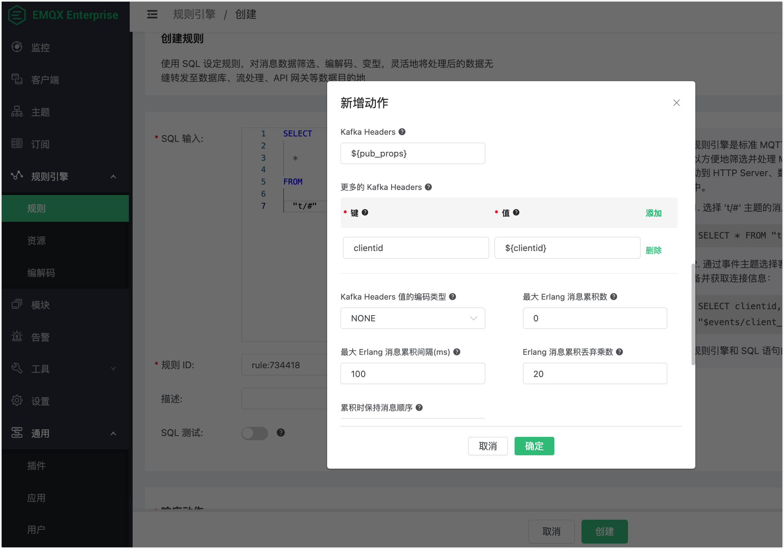
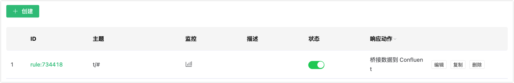

# 集成 Confluent

Confluent Cloud 基于 Apache Kafka，是一项弹性、可扩展、并完全托管的流式数据服务。EMQX 支持通过数据桥接实现与 Confluent 的数据集成，使您能够轻松将 MQTT 数据流式传输到 Confluent。本页面主要为您介绍了Confluent 集成的特性和优势，并指导您如何配置 Confluent Cloud 以及如何在 EMQX 中创建 Confluent 数据桥接。

## 特性与优势

EMQX 与 Confluent 的集成具备以下特性与优势：

- **大规模消息传输的可靠性**：EMQX 和 Confluent Cloud 均采用了高可靠的集群机制，可以建立稳定可靠的消息传输通道，确保大规模物联网设备消息的零丢失。两者都可以通过添加节点实现水平扩展、动态调整资源来应对突发的大规模消息，保证消息传输的可用性。

- **强大的数据处理能力**：EMQX 的本地规则引擎与 Confluent Cloud 都提供了可靠的流式数据处理能力，作用在物联网数据从设备到应用的不同阶段，可以根据场景选择性地进行实时的数据过滤、格式转换、聚合分析等处理，实现更复杂的物联网消息处理流程，满足数据分析应用的需求。

- **强大的集成能力**：通过 Confluent Cloud 提供的各种 Connector，可以帮助 EMQX 轻松集成其他数据库、数据仓库、数据流处理系统等，构建完整的物联网数据流程，实现数据的敏捷分析应用。

- **高吞吐量场景下的处理能力**：支持同步和异步两种写入模式，您可以区分实时优先和性能优先的数据写入策略，并根据不同场景实现延迟和吞吐量之间的灵活平衡。

- **有效的主题映射**：通过桥接配置，可以将众多 IoT 业务主题映射到 Kakfa 主题。EMQX 支持 MQTT 用户属性映射到 Kafka Header，并采用多种灵活的主题映射方式，包括一对一、一对多、多对多，还支持 MQTT 主题过滤器（通配符）。

## 配置 Confluent Cloud

在创建 Confluent 数据桥接之前，您必须在 Confluent Cloud 控制台中创建 Confluent 集群，并使用 Confluent Cloud CLI 创建主题和 API 密钥。

### 创建集群

1. 登录到 Confluent Cloud 控制台并创建一个集群。选择 Standard 集群作为示例，然后点击 **Begin configuration**。

   

2. 选择 Region/zones。确保部署区域与 Confluent Cloud 的区域匹配。然后点击 **Continue**。

   

3. 输入您的集群名称，然后点击 **Launch cluster**。

   

### 使用 Confluent Cloud CLI 创建主题和 API 密钥

现在，您已在 Confluent Cloud 中运行集群，并且可以在 **Cluster Overview** -> **Cluster Settings** 页面中获取 **Bootstrap server** URL。


您可以使用 Confluent Cloud CLI 来管理集群。以下是使用 Confluent Cloud CLI 的基本命令。

#### 安装 Confluent Cloud CLI

```bash
curl -sL --http1.1 https://cnfl.io/cli | sh -s -- -b /usr/local/bin
```

如果您已经安装了，您可以使用以下命令来进行更新：

```bash
confluent update
```

#### 登录到您的帐户

```bash
confluent login --save
```

#### 选择环境

```bash
# list env
confluent environment list
# use env
confluent environment use <environment_id>
```

#### 选择集群

```bash
# list kafka cluster
confluent kafka cluster list
# use kafka
confluent kafka cluster use <kafka_cluster_id>
```

#### 使用 API 密钥和 Secret

如果您想使用现有的 API 密钥，请使用以下命令将其添加到 CLI：

```bash
confluent api-key store --resource <kafka_cluster_id>
Key: <API_KEY>
Secret: <API_SECRET>
```

如果您没有 API 密钥和 Secret，可以使用以下命令创建：

```bash
$ confluent api-key create --resource <kafka_cluster_id>

It may take a couple of minutes for the API key to be ready.
Save the API key and secret. The secret is not retrievable later.
+------------+------------------------------------------------------------------+
| API Key    | YZ6R7YO6Q2WK35X7                                                 |
| API Secret | ****************************************                         |
+------------+------------------------------------------------------------------+
```

将它们添加到 CLI 后，您可以通过执行以下命令使用 API 密钥和 Secret：

```bash
confluent api-key use <API_Key> --resource <kafka_cluster_id>

```

#### 创建主题

您可以使用以下命令创建一个主题：

```bash
confluent kafka topic create <topic_name>
```

您可以使用以下命令检查主题列表：

```bash
confluent kafka topic list
```

#### 向主题生成消息

您可以使用以下命令创建生产者。启动生产者后，输入一条消息并按 Enter 键。消息将被生成到相应的主题中。

```bash
confluent kafka topic produce <topic_name>
```

#### 从主题消费消息

您可以使用以下命令创建消费者。它将输出相应主题中的所有消息。

```bash
confluent kafka topic consume -b <topic_name>
```

## 创建 Confluent 数据桥接

本节介绍了在 EMQX Dashboard 中如何通过创建规则并添加规则动作以将数据转发到 Confluent 来创建一个 Confluent 数据桥接。

1. 在 Dashboard 左侧导航菜单中点击**规则引擎** -> **规则**。

2. 在规则创建页面上，点击**创建**。在 **SQL** 文本框中输入以下 SQL：

   ```sql
   SELECT
       *
   FROM
       "t/#"
   ```

3. 点击**响应动作**区域的**添加动作**按钮。在**新增动作**对话框中，从**动作类型**下拉框中选择`数据转发` -> `数据桥接到 Confluent`。

   

4. 点击**使用资源**下拉框边上的**新建**，为动作绑定一个资源。

5. 在**创建资源**对话中，将 Confluent 集群设置页面的 Endpoints 中的信息填入**Bootstrap 服务器** 文本框。将您之前用 Confluent Cloud CLI 创建的 API 密钥和 Secret 填入 **Key** 和 **Secret** 文本框。其余选项均使用默认值。

6. 点击**测试**按钮以确保可以成功创建连接，然后点击**确定**按钮。

   

7. 返回到**添加动作**对话框，配置规则动作的选项：

   - **Kafka 主题**：输入您在配置 Confluent 时创建的主题，例如 `t.1`。

   - **Kafka Headers**：（可选）此字段用于直接将规则输出的变量作为 Kafka Headers 发送。例如，如果您输入`${pub_props}`，则动作将经规则处理的 MQTT 消息的所有 PUBLISH 属性作为 Kafka Header 发送。

   - **更多 Kafka Header**：（可选）此字段允许您以键值对形式添加一个或多个 Kafka Header。键和值可以使用`${var}`的格式作为占位符。例如，您可以添加一个键为`clientid`，值为`${clientid}`的键值对。当具有客户端 ID `foo` 的 MQTT 客户端触发动作时，它将发送一个 Kafka Header `clientid: foo`。

   - **Kafka Headers 值的编码类型**：此字段允许您选择指定在 **Kafka Header** 和**更多 Kafka Header** 字段中的键的编码模式。当指定的键不是字符串格式，或者指定的值不是二进制或字符串格式时，值将在发送之前进行编码。

     ::: 提示

     根据 [规范](https://cwiki.apache.org/confluence/display/KAFKA/KIP-82+-+Add+Record+Headers) ，Kafka Header 的键必须是字符串格式（utf8），其值必须是二进制或字符串格式。

     :::

     该字段有两个可选值：`NONE` 或 `JSON`：

     - `NONE`：此选项仅发送具有字符串键和二进制或字符串值的 Header。它丢弃所有具有其他键和值格式的 Header。
     - `JSON`：使用此选项，系统将尝试将 `value` 编码为 JSON 字符串，然后发送任何 Header。如果编码成功，则发送 Header；否则，将被丢弃。此外，`key` 必须是字符串格式；否则，它也将被丢弃。

   - 将其他选项保留为默认设置。

8. 点击**确定**按钮。

   

9. 回到规则创建页面，您可以看到一个处理命中规则消息的动作已被添加到**响应动作**区域。点击**确定**按钮，可以看到规则列表中显示了您创建的规则。

   

## 测试数据桥接

1. 通过发送一条 MQTT 消息到 EMQX，您可以测试 Confluent 数据桥接是否正常运行：

```bash
Topic: "t/1"

QoS: 0

Retained: false

Payload: "hello"
```

2. 您可以使用 Confluent 命令从主题 `t.1` 中消费消息。

```bash
confluent kafka topic consume -b t.1
```

3. 点击规则**监控**列中的图标，规则统计中的**命中次数**应增加 1。

