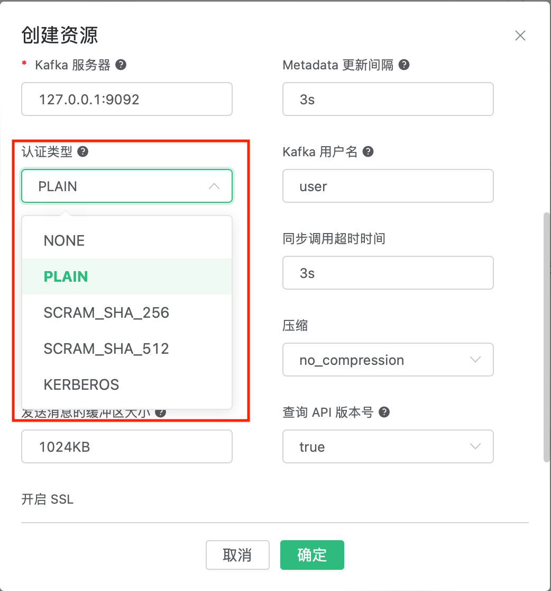
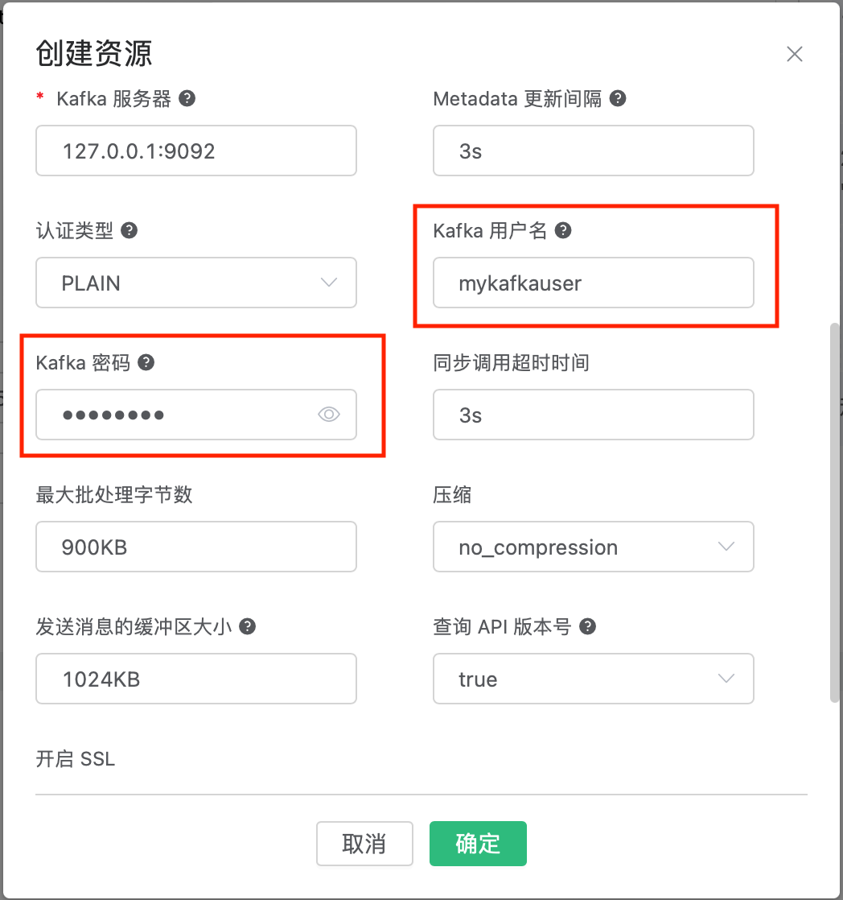
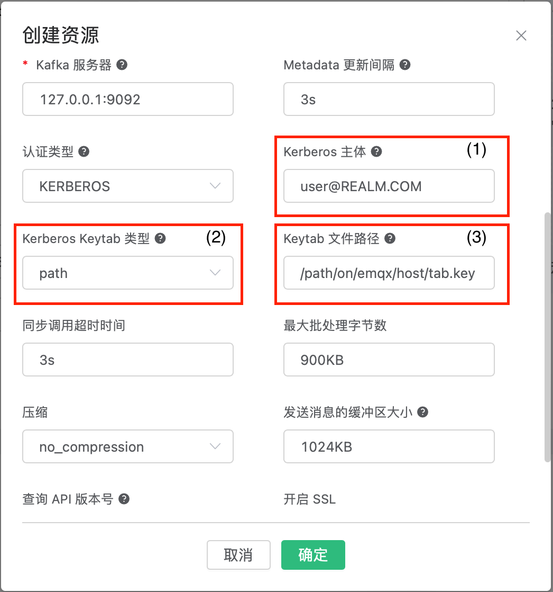
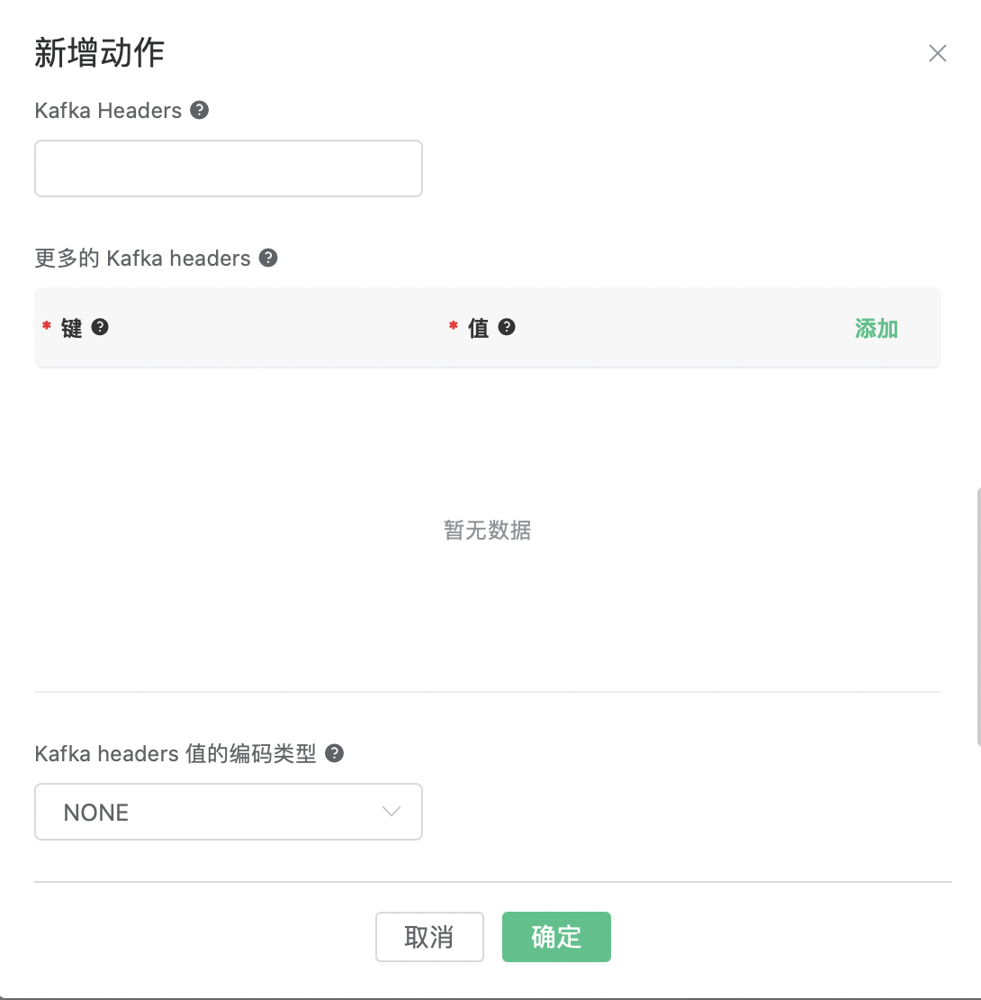

# 集成 Kafka

搭建 Kafka 环境，以 MacOS X 为例:

```bash
wget https://archive.apache.org/dist/kafka/2.8.0/kafka_2.13-2.8.0.tgz

tar -xzf  kafka_2.13-2.8.0.tgz

cd kafka_2.13-2.8.0

# 启动 Zookeeper
./bin/zookeeper-server-start.sh config/zookeeper.properties
# 启动 Kafka
./bin/kafka-server-start.sh config/server.properties
```

创建 Kafka 的主题:

```bash
$ ./bin/kafka-topics.sh --zookeeper localhost:2181 --replication-factor 1 --partitions 1 --topic testTopic --create
```

:::
创建 Kafka Rule 之前必须先在 Kafka 中创建好主题，否则创建 Kafka Rule 失败。
:::

创建规则:

打开 [EMQX Dashboard](http://127.0.0.1:18083/#/rules)，选择左侧的 “规则” 选项卡。

填写规则 SQL:

```sql
SELECT * FROM "t/#"
```


关联动作:

在 “响应动作” 界面选择 “添加”，然后在 “动作” 下拉框里选择 “桥接数据到 Kafka”。


填写动作参数:

“保存数据到 Kafka 动作需要两个参数：

1). Kafka 的消息主题

2). 关联资源。现在资源下拉框为空，可以点击右上角的 “新建资源” 来创建一个 Kafka 资源:


选择 Kafka 资源”。

填写资源配置:

填写真实的 Kafka 服务器地址，多个地址用,分隔，其他配置保持默认值，然后点击 “测试连接” 按钮，确保连接测试成功。

最后点击 “新建” 按钮。


返回响应动作界面，点击 “确认”。


返回规则创建界面，点击 “新建”。
</br>按照Kafka的业务数据，填写 `Kafka 主题` `Produce 类型` `Produce 策略`  `Strategy Key`  `磁盘缓存`，
其中，`消息内容模板` 字段，支持变量。若使用空模板（默认），消息内容为 JSON 格式的所有字段。


规则已经创建完成，现在发一条数据:

```bash
Topic: "t/1"

QoS: 0

Payload: "hello"
```

然后通过 Kafka 命令去查看消息是否生产成功:

```bash
$ ./bin/kafka-console-consumer.sh --bootstrap-server 127.0.0.1:9092  --topic testTopic --from-beginning
```


在规则列表里，可以看到刚才创建的规则的命中次数已经增加了 1:


## 认证

这一章节讲解如何配置和使用 Kafka 资源的认证功能。

EMQX Kafka 资源支持如下几种认证方式：`NONE` (无认证)，`SCRAM_SHA_256`， `SCRAM_SHA_512`，以及 `Kerberos`。
关于如何使用这些不同的认证机制，请参考 [Kafka 文档](https://docs.confluent.io/platform/current/kafka/overview-authentication-methods.html)

要使用的认证机制可以在 “认证类型” 下面选择（见下图）。选择的认证类型不同，将显示不同的字段。



PLAIN, SCRAM_SHA_256, 和 SCRAM_SHA_512 几种认证方式需要的字段是 Kafka 用户名及密码（见下图）。




Kerberos身份验证方法的配置稍微复杂一些。

在使用 Kerberos 身份验证设置 Kafka 资源之前，我们假设您有一个使用 Kerberos 认证的 Kafka 实例和一个 Kerberos 主体（也称为用户）的 Keytab 文件，该主体具有访问 Kafka 示例的权限。

关于如何配置 Kerberos 认证，请参考 [Kafka 文档](https://docs.confluent.io/platform/current/kafka/authentication_sasl/authentication_sasl_gssapi.html#kafka-sasl-auth-gssapi) 以及 [Kerberos](https://web.mit.edu/kerberos/krb5-latest/doc/admin/index.html)

你还可以参考 [Kafka and Kerberos example from the brod_gssapi project](https://github.com/kafka4beam/brod_gssapi/tree/master/example).

Here is a list of common pitfalls that is worth being aware of before proceeding:

在继续之前，这里列出了一些常见的坑请您注意一下：

* 要使Kerberos身份验证正常工作，必须在运行EMQX的主机上安装Kerberos库、SASL库和SASL/GSSAPI Kerberos插件。
  EMQX的官方Docker映像包含所需的库。如果您自己构建EMQX，则必须确保在构建开始之前安装了所需的库。
  如果构建过程未找到Kerberos身份验证所需的库，则在构建时将打印警告，并禁用对Kerberos认证的支持。
  在 Centos 7 系统上, 需要安装以下软件包：`libsasl2`, `libsasl2-dev`, `krb5-workstation`,
  `cyrus-sasl-devel`, `cyrus-sasl`, `cyrus-sasl-gssapi` 和 `krb5-server`.
  在 Ubuntu 22.04 系统上, 需要安装以下软件包：`krb5-kdc`, `krb5-admin-server`, `libkrb5-dev`,
  `libsasl2-dev` and `libsasl2-modules-gssapi-mit`。
  关于在其他平台上需要哪些软件包，请参考 [EMQX 官方容器文件](https://github.com/emqx/emqx-builder)。

* Kerberos配置文件`/etc/krb5.conf`需要在所有Kerberos客户端和服务器之间同步。
  必须将`/etc/krb5.conf`文件复制到多节点集群中的所有节点。关于如何配置 `/etc/krb5.conf`，请参考
  [Kerberos 文档](https://web.mit.edu/kerberos/krb5-latest/doc/admin/conf_files/krb5_conf.html?highlight=krb5%20conf).

* Kerberos 是时间敏感的，因此运行 EMQX、Kerberos 密钥分发中心，以及 Kafka 的主机的时间必须同步。

使用 Kerberos 认证配置 Kafka 资源时，必须设置 Kerberos 主体（下图中的（1））和相应的 Kerberos Keytab（下图中为（2）和（3））。
有两个选项用于指定 Keytab 文件（下图中的（2））。Keytab 可以直接从配置 UI 上传到主机，也可以指定指向主机上的 Keytab 文件路径。
标有（3）的字段的类型会根据如何设置标有（2）的字段而变化。如果指定了 Keytab 路径并将 EMQX 设置为多节点群集，则必须将 Keytab 文件上载到所有节点上指定的路径。



## Kafka Headers

从 EMQX 企业版 4.4.15 开始，Kafka 动作支持了 Kafka Headers：



新增了图中三个字段：`Kafka Headers`，`更多的 Kafka headers`，`Kafka headers 值的编码类型`。

### Kafka Headers：

这个字段用来直接把规则输出的某个变量整个当做 Kafka Headers 发送。该字段为可选字段。

比如我们可以填写 `${pub_props}`，这样对于监听 MQTT 消息的规则，Kafka 动作将会把该 MQTT 消息的所有 PUBLISH Properties 当做 Kafka Headers 发送。

### 更多的 Kafka headers：

这个字段提供了以 `键-值` 对的格式添加一个或者多个 Kafka headers 的方法。其中键和值都可以使用 `${var}` 格式的占位符。该字段为可选字段。

比如我们可添加一个键值对，键为 `clientid`，值为 `${clientid}`，那么当客户端 ID 为 `foo` 的客户端触发该动作时，它会发送 `clientid: foo` 这样一个 Kafka Header 出去。

### Kafka headers 值的编码类型：

根据 Kafka 的[规定](https://cwiki.apache.org/confluence/display/KAFKA/KIP-82+-+Add+Record+Headers)，Kafka Headers 的键必须为字符串格式（utf8），并且其值必须为二进制或字符串格式。
所以如果 “Kafka Headers” 和 “更多的 Kafka headers” 两个字段里，指定的键不是字符串格式，或者指定的值不是二进制或字符串格式的时候，EMQX 的 Kafka 动作需要在发送之前做一些处理。

这个字段有两种可选值：`NONE` 或 `JSON`：

- NONE: 仅发送键为字符串、值为二进制或字符串格式的 Headers，其他格式的 Headers 将会被丢弃。

- JSON: 在发送任何 Headers 之前，都尝试将`值`编码为 JSON 字符串，如果编码成功则发送，否则丢弃。另外，Headers 的`键`必须为字符串格式，否则丢弃。
