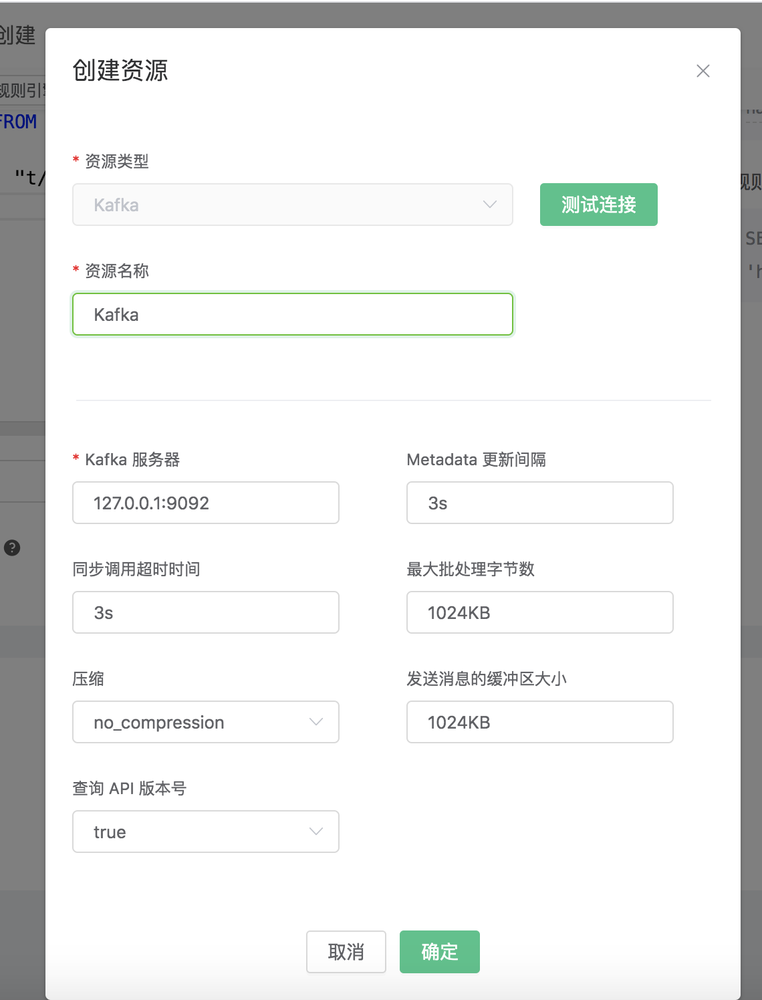
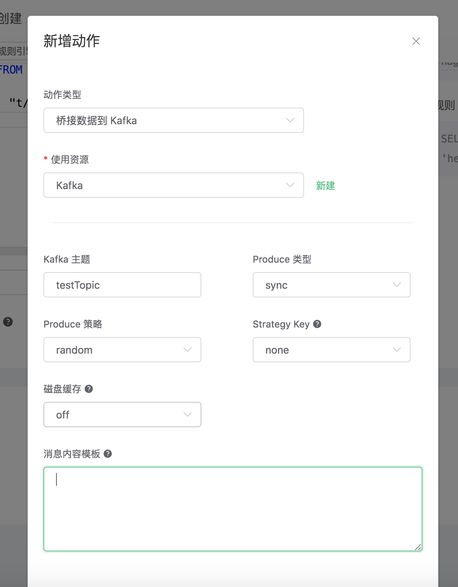
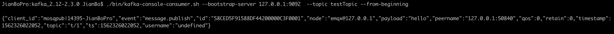
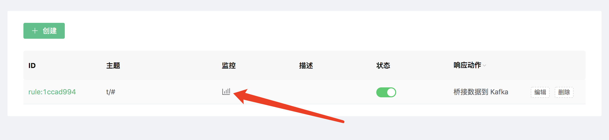

# 桥接数据到 Kafka

搭建 Kafka 环境，以 MacOS X 为例:
```bash
$ wget http://apache.claz.org/kafka/2.3.0/kafka_2.12-2.3.0.tgz

$ tar -xzf  kafka_2.12-2.3.0.tgz

$ cd kafka_2.12-2.3.0

# 启动 Zookeeper
$ ./bin/zookeeper-server-start.sh config/zookeeper.properties
# 启动 Kafka
$ ./bin/kafka-server-start.sh config/server.properties
```

创建 Kafka
​       的主题:

```bash
$ ./bin/kafka-topics.sh --zookeeper localhost:2181 --replication-factor 1 --partitions 1 --topic testTopic --create
```

::: danger
创建 Kafka Rule 之前必须先在 Kafka 中创建好主题，否则创建 Kafka Rule 失败。
:::

创建规则:

打开 [EMQ X Dashboard](http://127.0.0.1:18083/#/rules)，选择左侧的 “规则” 选项卡。

填写规则 SQL:

```sql
SELECT * FROM "t/#"
```


关联动作:

在 “响应动作” 界面选择 “添加”，然后在 “动作” 下拉框里选择 “桥接数据到 Kafka”。


填写动作参数:

“保存数据到 Kafka 动作需要两个参数：

1). Kafka 的消息主题

2). 关联资源。现在资源下拉框为空，可以点击右上角的 “新建资源” 来创建一个 Kafka 资源:


选择 Kafka 资源”。

填写资源配置:

填写真实的 Kafka 服务器地址，多个地址用,分隔，其他配置保持默认值，然后点击 “测试连接” 按钮，确保连接测试成功。

最后点击 “新建” 按钮。



返回响应动作界面，点击 “确认”。



返回规则创建界面，点击 “新建”。


规则已经创建完成，现在发一条数据:

```bash
Topic: "t/1"

QoS: 0

Payload: "hello"
```

然后通过 Kafka 命令去查看消息是否生产成功:

```bash
$ ./bin/kafka-console-consumer.sh --bootstrap-server 127.0.0.1:9092  --topic testTopic --from-beginning
```



在规则列表里，可以看到刚才创建的规则的命中次数已经增加了 1:


