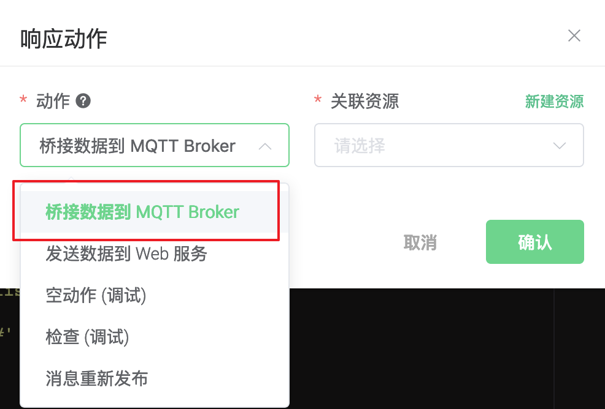
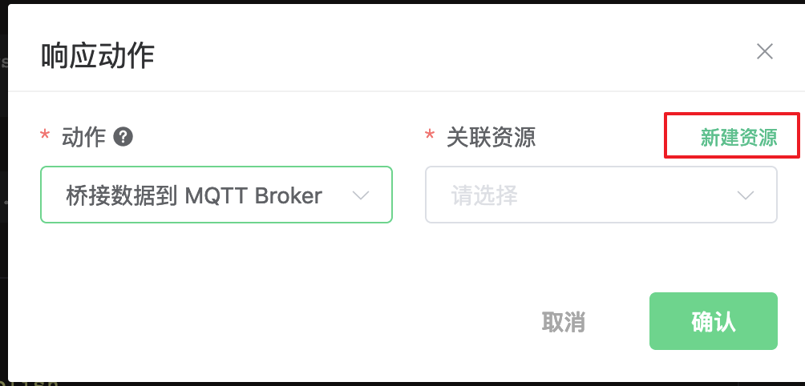
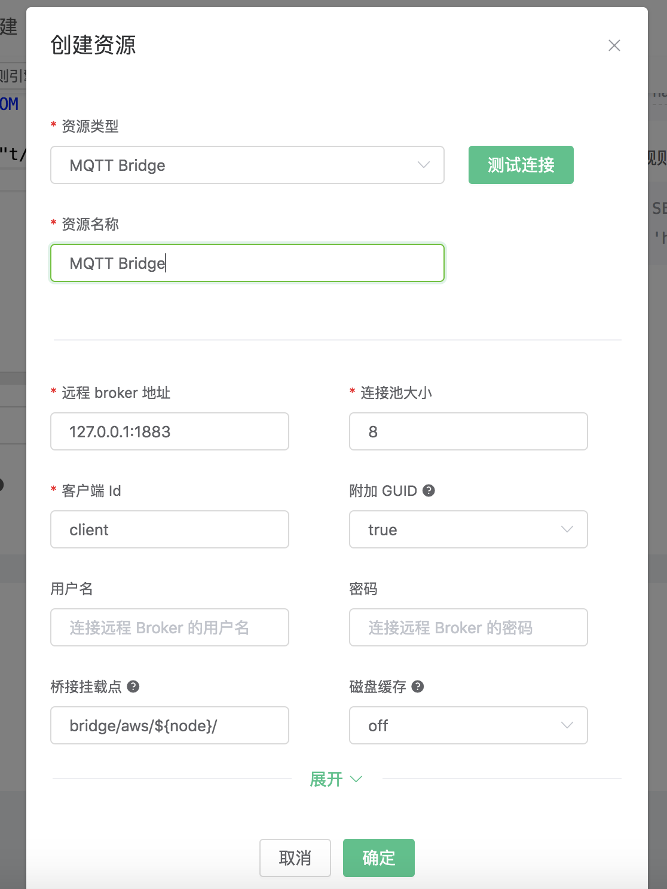
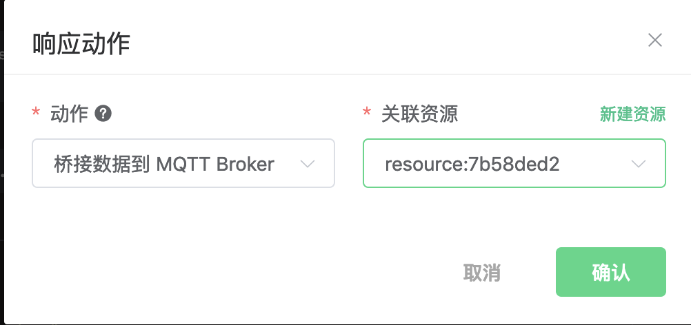

# 集成 MQTT Broker

搭建 MQTT Broker 环境，以 MacOS X 为例:
```bash
$ brew install mosquitto

启动 mosquitto
$ mosquitto
```
创建规则:

打开 [EMQX Dashboard](http://127.0.0.1:18083/#/rules)，选择左侧的 “规则” 选项卡。

填写规则 SQL:

```sql
SELECT * FROM "t/#"
```


关联动作:

在 “响应动作” 界面选择 “添加”，然后在 “动作” 下拉框里选择 “桥接数据到 MQTT Broker”。



填写动作参数:

"桥接数据到 MQTT Broker" 动作只需要一个参数：

关联资源。现在资源下拉框为空，可以点击右上角的 “新建资源” 来创建一个 MQTT Bridge 资源:



选择 MQTT Bridge 资源,填写资源配置:

   填写真实的 mosquitto 服务器地址，其他配置保持默认值，然后点击 “测试连接” 按钮，确保连接测试成功。

</br>注意：</br>

`附加 GUID` 选项，设置为 `true` 时，MQTT 连接使用的 clientid 增加随机后缀以保证全局唯一性。
设置为 `false` 时，会导致 clientid 使用同一个，连接池中线程互踢，EMQX 多个节点之间的桥接也会互踢，推荐仅在单节点 EMQX 且连接池大小为 1 时开启此选项。

最后点击 “新建” 按钮。



返回响应动作界面，点击 “确认”。



返回规则创建界面，点击 “新建”。


规则已经创建完成，现在发一条数据:

```bash
Topic: "t/1"

QoS: 0

Payload: "Hello, World\!"
```

然后通过 mqtt 客户端查看消息是否发布成功


在规则列表里，可以看到刚才创建的规则的命中次数已经增加了 1:


