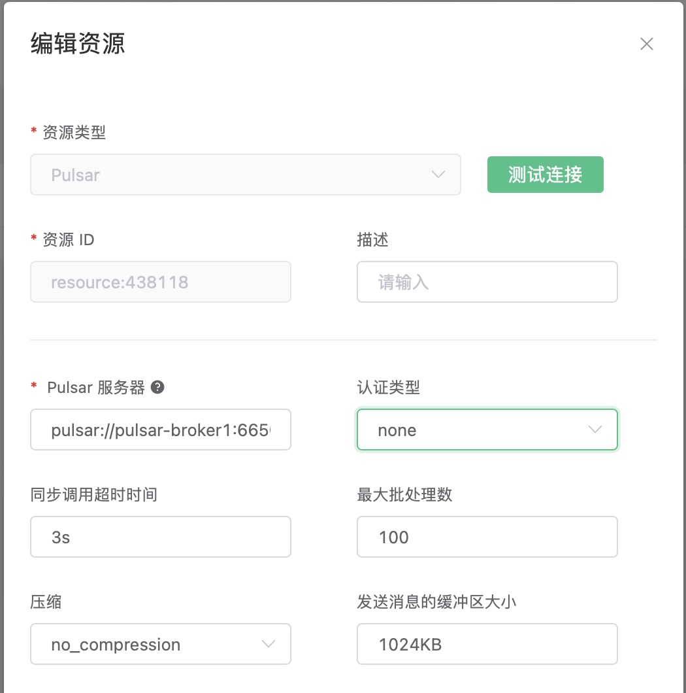

# 桥接数据到 Pulsar

搭建 Pulsar 环境，以 MacOS X 为例:

```bash
$ wget https://archive.apache.org/dist/pulsar/pulsar-2.3.2/apache-pulsar-2.3.2-bin.tar.gz

$ tar xvfz apache-pulsar-2.3.2-bin.tar.gz

$ cd apache-pulsar-2.3.2

# 启动 Pulsar
$ ./bin/pulsar standalone
```

创建 Pulsar 的主题:

```bash
$ ./bin/pulsar-admin topics create-partitioned-topic -p 5 testTopic
```

创建规则:

打开 [EMQX Dashboard](http://127.0.0.1:18083/#/rules)，选择左侧的 “规则” 选项卡。

填写规则 SQL:

```sql
SELECT * FROM "t/#"
```


关联动作:

在 “响应动作” 界面选择 “添加”，然后在 “动作” 下拉框里选择 “桥接数据到 Pulsar”。


填写动作参数:

“保存数据到 Pulsar 动作需要两个参数：

1). Pulsar 的消息主题

2). 关联资源。现在资源下拉框为空，可以点击右上角的 “新建资源” 来创建一个 Pulsar 资源:


选择 Pulsar 资源”。

填写资源配置:

   填写真实的 Pulsar 服务器地址，多个地址用,分隔，其他配置保持默认值，然后点击 “测试连接” 按钮，确保连接测试成功。
   
   服务器地址是逗号分隔的多个 Pulsar URL, URL 格式为 `pulsar://<hostname>:<port>`，如果 Pulsar 端开启了 TLS 的话，则格式为 `pulsar+ssl://<hostname>:<port>`。

最后点击 “新建” 按钮。



返回响应动作界面，点击 “确认”。


返回规则创建界面，点击 “新建”。


规则已经创建完成，现在发一条数据:

```bash
Topic: "t/1"

QoS: 0

Payload: "hello"
```

然后通过 Pulsar 命令去查看消息是否生产成功:

```bash
$ ./bin/pulsar-client consume testTopic  -s "sub-name" -n 1000
```


在规则列表里，可以看到刚才创建的规则的命中次数已经增加了 1:


## 使用 Pulsar basic/token 认证

EMQX 企业版 4.3.10 以及 4.4.4 以后，我们支持了 Pulsar 的 `basic` 和 `token` 认证.

比如, 要启用 `token` 认证, 从 `Authentication Type` 下拉框选择 `token`:


然后在对话框的下方提供 JWT:


