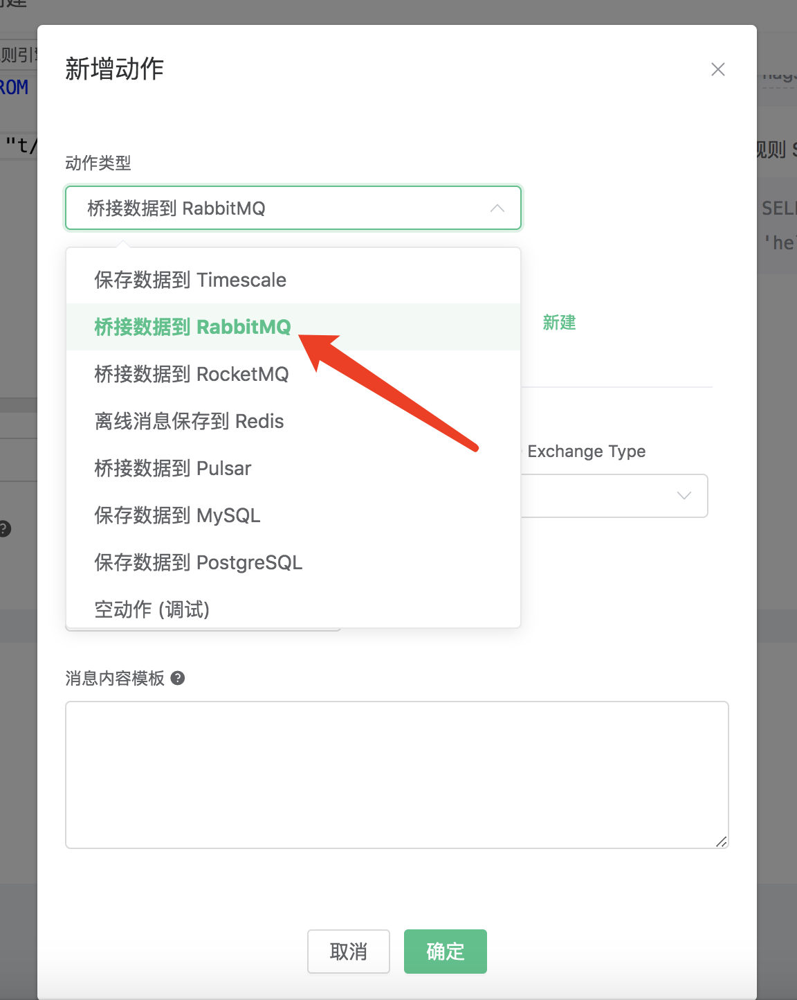
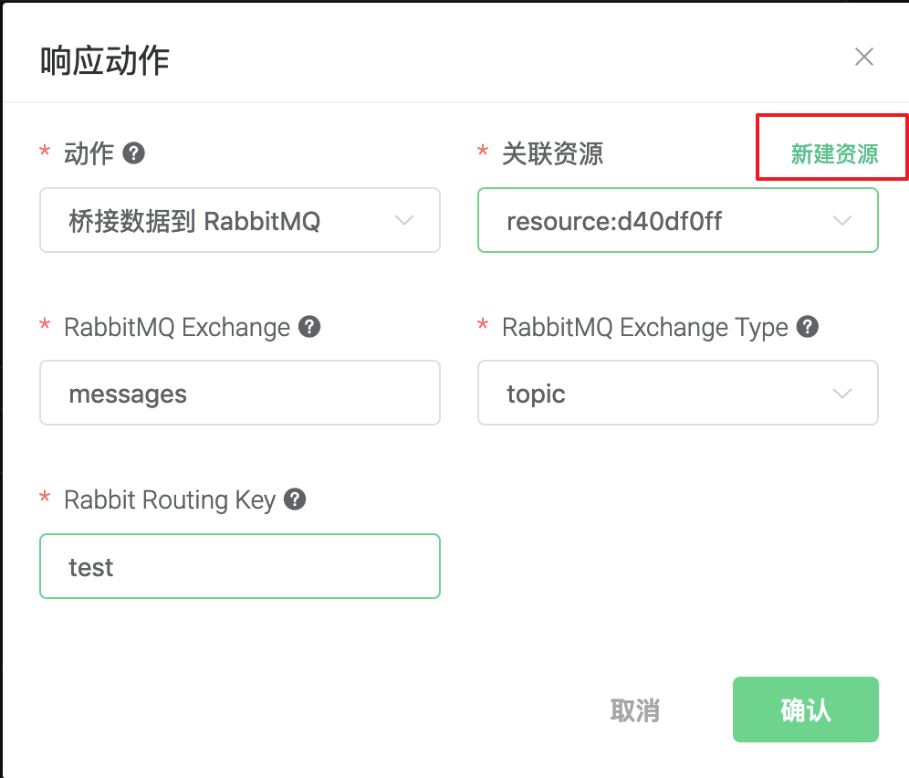

# 桥接数据到 RabbitMQ

搭建 RabbitMQ 环境，以 MacOS X 为例:

```bash
$ brew install rabbitmq

# 启动 rabbitmq
$ rabbitmq-server
```

创建规则:

打开 [EMQ X Dashboard](http://127.0.0.1:18083/#/rules)，选择左侧的 “规则” 选项卡。

填写规则 SQL:

```sql
SELECT * FROM "t/#"
```


关联动作:

在 “响应动作” 界面选择 “添加”，然后在 “动作” 下拉框里选择 “桥接数据到 RabbitMQ”。



填写动作参数:

“桥接数据到 RabbitMQ 动作需要四个参数：

1). RabbitMQ Exchange。这个例子里我们设置 Exchange 为 "messages"，

2). RabbitMQ Exchange Type。这个例子我们设置 Exchange Type 为 "topic"

3). RabbitMQ Routing Key。这个例子我们设置 Routing Key 为 "test"

4). 关联资源。现在资源下拉框为空，可以点击右上角的 “新建资源” 来创建一个 RabbitMQ 资源:



选择 RabbitMQ 资源。

填写资源配置:

   填写真实的 RabbitMQ 服务器地址，其他配置保持默认值，然后点击 “测试连接” 按钮，确保连接测试成功。

最后点击 “新建” 按钮。


返回响应动作界面，点击 “确认”。


返回规则创建界面，点击 “新建”。


规则已经创建完成，现在发一条数据:

```bash
Topic: "t/1"

QoS: 0

Payload: "Hello, World\!"
```

编写 amqp 协议的客户端，以下是用 python 写的 amqp 客户端的示例代码:

```python
#!/usr/bin/env python
import pika

connection = pika.BlockingConnection(
    pika.ConnectionParameters(host='localhost'))
channel = connection.channel()

channel.exchange_declare(exchange='messages', exchange_type='topic')

result = channel.queue_declare(queue='', exclusive=True)
queue_name = result.method.queue

channel.queue_bind(exchange='messages', queue=queue_name, routing_key='test')

print('[*] Waiting for messages. To exit press CTRL+C')

def callback(ch, method, properties, body):
    print(" [x] %r" % body)

channel.basic_consume(
    queue=queue_name, on_message_callback=callback, auto_ack=True)

channel.start_consuming()
```

然后通过 amqp 协议的客户端查看消息是否发布成功, 以下是


在规则列表里，可以看到刚才创建的规则的命中次数已经增加了 1:


