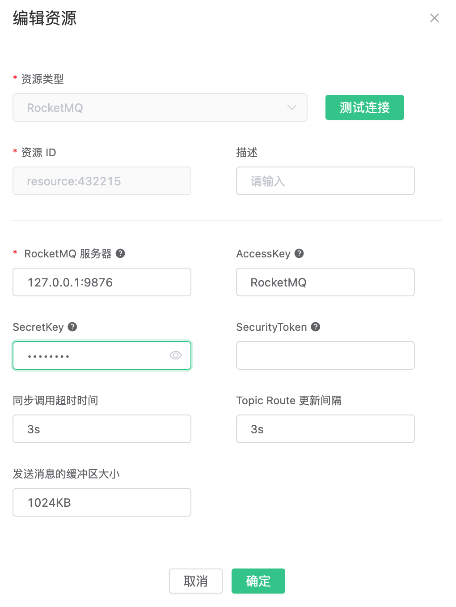

# 桥接数据到 RocketMQ

搭建 RocketMQ 环境，以 MacOS X
​       为例:

```bash
$ wget http://mirror.metrocast.net/apache/rocketmq/4.5.2/rocketmq-all-4.5.2-bin-release.zip

$ unzip rocketmq-all-4.5.2-bin-release.zip

$ cd rocketmq-all-4.5.2-bin-release

# 在conf/broker.conf添加了2个配置
brokerIP1 = 127.0.0.1
autoCreateTopicEnable = true

# 启动 RocketMQ NameServer
$ ./bin/mqnamesrv

# 启动 RocketMQ Broker
$ ./bin/mqbroker -n localhost:9876 -c conf/broker.conf
```

创建规则:

打开 [EMQ X Dashboard](http://127.0.0.1:18083/#/rules)，选择左侧的 “规则” 选项卡。

填写规则 SQL:

```sql
SELECT * FROM "t/#"
```


关联动作:

在 “响应动作” 界面选择 “添加”，然后在 “动作” 下拉框里选择 “桥接数据到 RocketMQ”。


填写动作参数:

“保存数据到 RocketMQ 动作需要两个参数：

1). RocketMQ 的消息主题

2). 关联资源。现在资源下拉框为空，可以点击右上角的 “新建资源” 来创建一个 RocketMQ 资源:



填写资源配置:

   填写真实的 RocketMQ 服务器地址，多个地址用,分隔，其他配置保持默认值，然后点击 “测试连接” 按钮，确保连接测试成功。

最后点击 “新建” 按钮。


返回响应动作界面，点击 “确认”。


返回规则创建界面，点击 “新建”。


规则已经创建完成，现在发一条数据:

```bash
Topic: "t/1"

QoS: 0

Payload: "hello"
```

然后通过 RocketMQ 命令去查看消息是否生产成功:
```bash
$ ./bin/tools.sh org.apache.rocketmq.example.quickstart.Consumer TopicTest
```


在规则列表里，可以看到刚才创建的规则的命中次数已经增加了 1:

