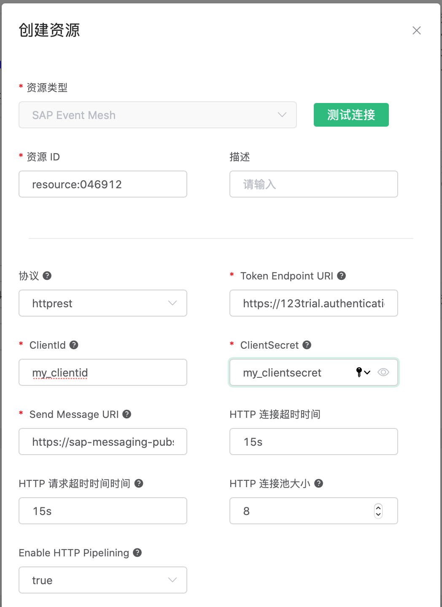

# 集成 SAP Event Mesh

EMQX 规则引擎支持通过 HTTP 请求方式（`httprest`）将消息发送到 [SAP Event Mesh](https://help.sap.com/viewer/bf82e6b26456494cbdd197057c09979f/Cloud/en-US)。

Event Mesh 是 [SAP BTP](https://www.sap.com/products/business-technology-platform.html) 重要的消息交换组件。
SAP BTP 囊括了 SAP 的所有技术组合，例如 SAP HANA（内存计算平台）、 SAP Analytics Cloud（分析云）、
SAP Integration 套件 （集成套件）和 SAP Extension 套件（扩展套件）。

EMQX 的物联网数据可以通过此通道进入到 SAP BTP 平台的诸多产品中。

## 准备 SAP Event Mesh 环境

准备 SAP Event Mesh 环境，并获取 Service Keys。

相关操作步骤见 [Create Instance of SAP Event Mesh](https://developers.sap.com/tutorials/cp-enterprisemessaging-instance-create.html)。

以下面的 Service Keys 为例:

```bash
{
    "xsappname": "some-app-name",
    "management": [
        {
            "oa2": {
                ...
            },
            "uri": "..."
        }
    ],
    "messaging": [
        {
            "oa2": {
                "clientid": "my_clientid",
                "clientsecret": "my_clientsecret",
                "tokenendpoint": "https://123trial.authentication.demo.com/oauth/token",
                "granttype": "client_credentials"
            },
            "protocol": [
                "amqp10ws"
            ]
        },
        {
            "oa2": {
                "clientid": "my_clientid",
                "clientsecret": "my_clientidsecret",
                "tokenendpoint": "https://123trial.authentication.demo.com/oauth/token",
                "granttype": "client_credentials"
            },
            "protocol": [
                "httprest"
            ],
            "broker": {
                "type": "saprestmgw"
            },
            "uri": "https://sap-messaging-pubsub.fooapps.demo.com"
        }
    ],
    "serviceinstanceid": "188783-7893-8765-8872-77866"
}
```

我们只关心 Service Keys 里面的 `"messaging"`字段，我们可以获取到以下与 `protocol: ["httprest"]` 相关的信息：

| Key                | Value|
|--------------------|------------------------------|
| Token Endpoint URI | https://123trial.authentication.demo.com/oauth/token |
| Send Message URI | https://sap-messaging-pubsub.fooapps.demo.com |
| ClientId | my_clientid |
| ClientSecret | my_clientsecret |

在 SAP Event Mesh 平台创建一个消息队列，名字为："my_queue_name"。

## 创建规则:

打开 [EMQX Dashboard](http://127.0.0.1:18083/#/rules)，选择左侧的 “规则” 选项卡。

### 填写规则 SQL:

```sql
SELECT
    *
FROM
    "#"
```


### 关联动作:

在 “响应动作” 界面选择 “添加”，然后在 “动作” 下拉框里选择 “发送数据到 SAP Event Mesh”。


“发送数据到 SAP Event Mesh” 动作需要填写以下几个参数：

1). 消息内容模板。这个例子里我们向 SAP Event Mesh 发送一条数据，消息模板为:

```
${payload}
```

2). 队列名。这里填写我们刚才在 SAP Event Mesh 平台创建的消息队列名字："my_queue_name"。

3). QoS。选择 SAP Event Mesh 的 QoS 级别。

4). 关联资源。现在资源下拉框为空，可以点击旁边的 “新建” 来创建一个 SAP Event Mesh 资源:

### 填写资源配置:

这里需要填写我们通过 Service Keys 获取到的信息，包括 `Token Endpoint URI`，`ClientId`，`ClientSecret`，`Send Message URI` 等。

其他参数保持默认，然后点击 “测试连接” 按钮，确保连接测试成功。最后点击 “确定” 按钮。



返回响应动作界面，点击 “确定”。


返回规则创建界面，点击 “创建”。


## 发送消息测试

规则已经创建完成，现在使用 MQTT 客户端向 emqx 发送一条数据:

```bash
Topic: "t/1"

QoS: 0

Payload: "abc"
```

现在您可以到 SAP Event Mesh 平台，检查是否可以从 "my_queue_name" 这个队列消费到我们刚才发送的数据： "abc"。
