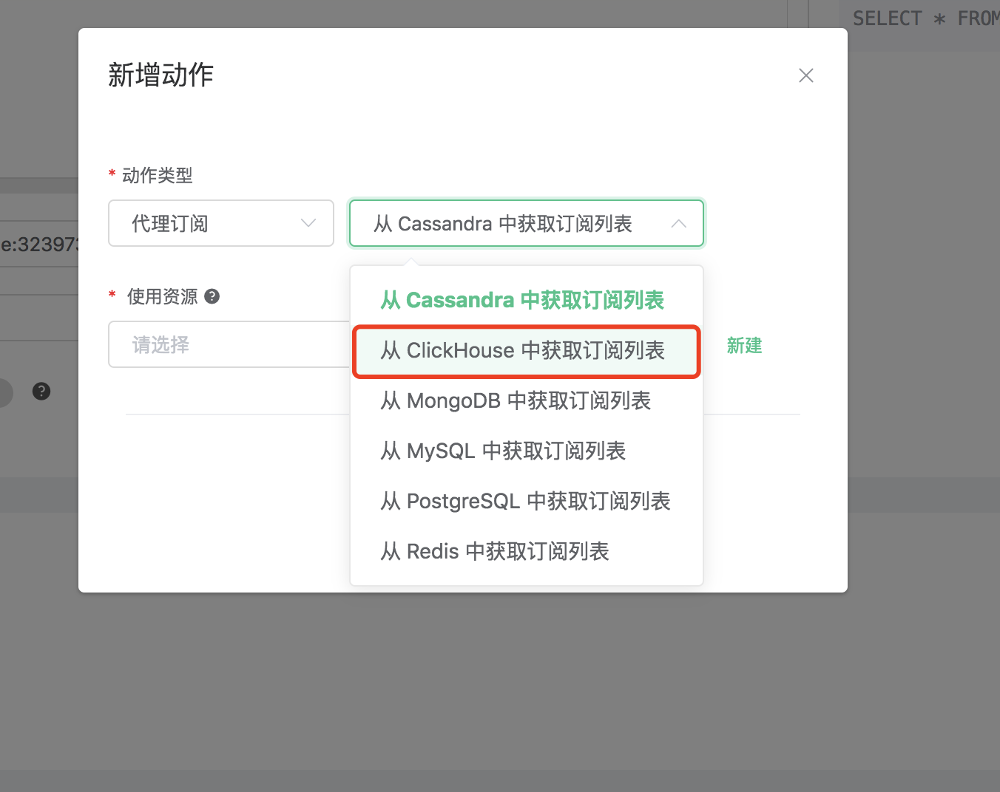
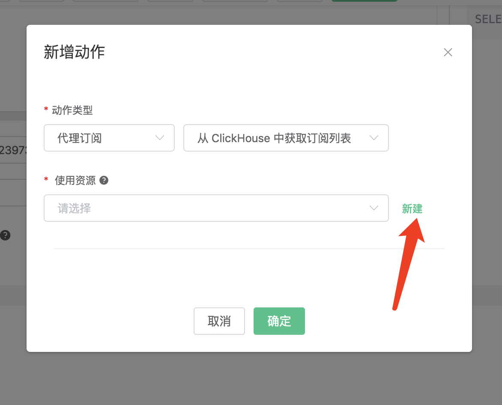
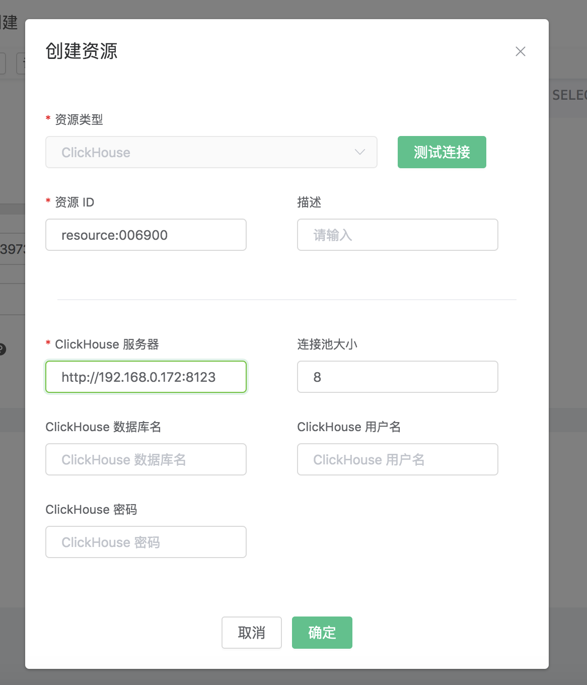
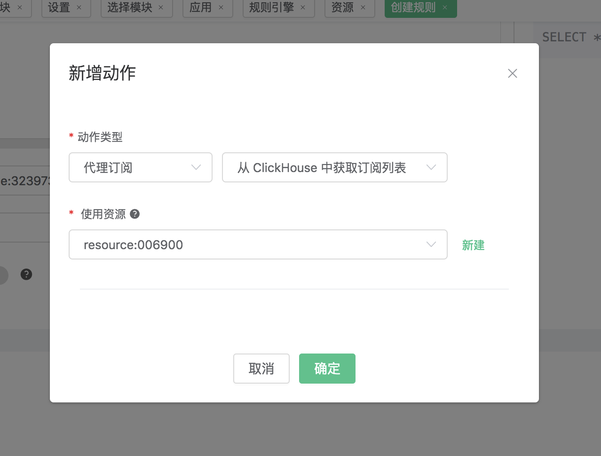
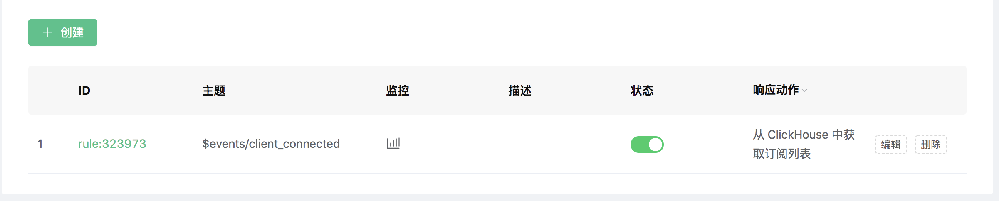
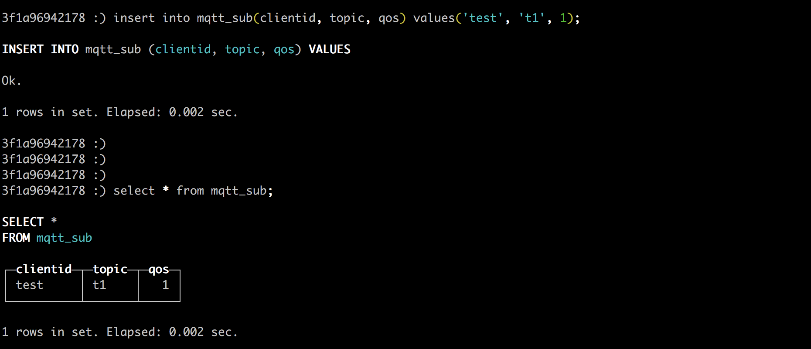

# 从 Redis 中获取订阅关系

搭建 ClickHouse 数据库，并设置用户名密码为 default/public，以 CentOS 为例:

```bash
## 安装依赖
sudo yum install -y epel-release

## 下载并运行packagecloud.io提供的安装shell脚本
curl -s https://packagecloud.io/install/repositories/altinity/clickhouse/script.rpm.sh | sudo bash

## 安装ClickHouse服务器和客户端
sudo yum install -y clickhouse-server clickhouse-client

## 启动ClickHouse服务器
clickhouse-server

## 启动ClickHouse客户端程序
clickhouse-client
```

创建 “mqtt” 数据库:
```bash
create database mqtt;
```
创建 mqtt_msg 表:

```sql
use mqtt;
create table mqtt_sub (
    clientid String,
    topic String,
    qos Nullable(Int8) DEFAULT 0
    ) engine = MergeTree() ORDER BY clientid;
```

::: danger

消息表结构不能修改，请使用上面SQL语句创建

:::

创建规则:

打开 [EMQ X Dashboard](http://127.0.0.1:18083/#/rules)，选择左侧的 “规则” 选项卡。

然后填写规则 SQL:

```bash
SELECT * FROM "$events/client_connected"
```


关联动作:

在 “响应动作” 界面选择 “添加动作”，然后在 “动作” 下拉框里选择 “从 ClickHouse 中获取订阅关系”。



填写动作参数:

“从 ClickHouse 中获取订阅列表”动作需要一个参数：

1). 关联资源。现在资源下拉框为空，可以点击右上角的 “新建资源” 来创建一个 ClickHouse 资源:



选择 ClickHouse 单节点模式资源”。



填写资源配置:

   填写真实的 ClickHouse 服务器地址，其他配置保持默认值，然后点击 “测试连接” 按钮，确保连接测试成功。

最后点击 “新建” 按钮。



返回响应动作界面，点击 “确认”。


返回规则创建界面，点击 “新建”。



规则已经创建完成，通过 ClickHouse 命令行 往 ClickHouse 插入一条订阅关系:

```bash
insert into mqtt_sub(clientid, topic, qos) values('test', 't1', 1);
```



通过 Dashboard  登录 clientid 为 test 的设备:


查看订阅列表，可以看到 **test** 设备已经订阅了 **t1** 主题:


