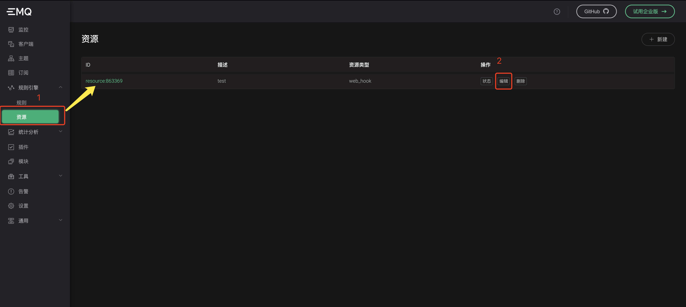
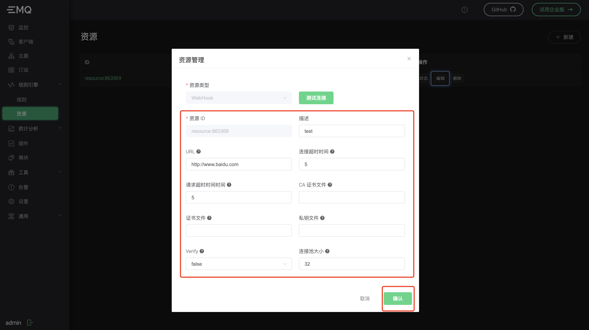
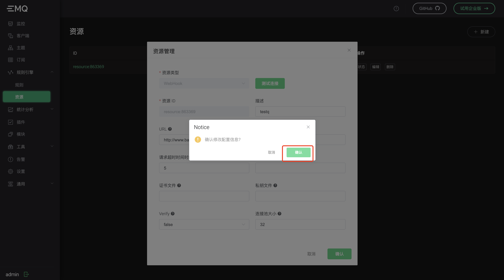
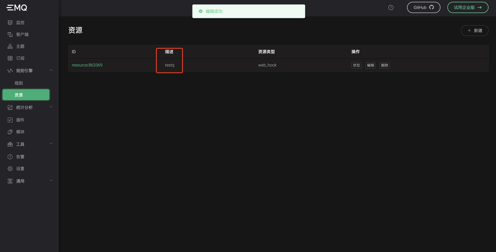
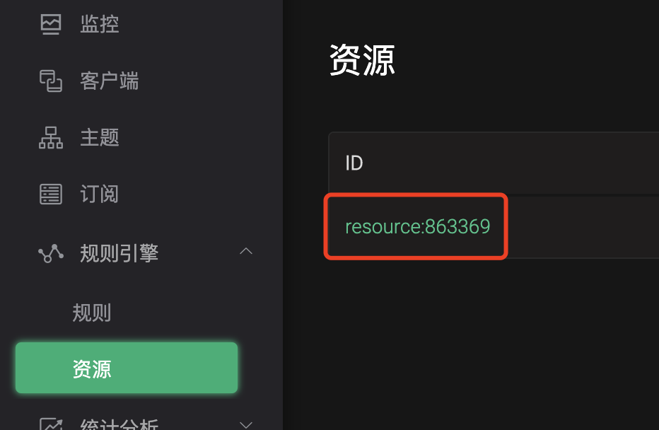

# 如何更新资源

## 通过管理界面

首先打开规则引擎的【资源】选项卡，选择你要更新的资源，然后点击【编辑】按钮:



此时会弹出编辑窗口：



输入你要修改的参数以后，点击【确认】按钮：



此时会提示是否确认修改，点击【确认】按钮即可，下图是修改后的效果：



此时“描述”信息已经被更新。

## 通过命令行

通过命令行更新，需要事先知道资源的ID：



然后使用下列命令更新：

```shell
emqx_ctl resources update $ID -d $Desc -c $Config
```

其中 `update` 后面的第一个参数为资源ID，`-d` 参数为“描述”  `-c` 参数为具体的资源参数的 ***JSON字符串*** 格式:

例如下面的这个JSON：

```json
{
    "verify":false,
    "url":"http://www.demo.com",
    "request_timeout":5,
    "pool_size":32,
    "keyfile":"",
    "connect_timeout":5,
    "certfile":"",
    "cacertfile":""
}
```

字符串格式是：

```shell
"{\"verify\":false,\"url\":\"http://www.demo.com\",\"request_timeout\":5,\"pool_size\":32,\"keyfile\":\"\",\"connect_timeout\":5,\"certfile\":\"\",\"cacertfile\":\"\"}"
```

完整命令：

```shell
emqx_ctl resources update resource:001 -d "hello" -c "{\"verify\":false,\"url\":\"http://www.demo.com\",\"request_timeout\":5,\"pool_size\":32,\"keyfile\":\"\",\"connect_timeout\":5,\"certfile\":\"\",\"cacertfile\":\"\"}"
```

至此为止，我们完成了通过管理界面和命令行两种更新资源的方式。