# 离线消息保存

## 离线消息保存到 Redis

搭建 Redis 环境，以 MacOS X 为例:

```bash
 $ wget http://download.redis.io/releases/redis-4.0.14.tar.gz
$ tar xzf redis-4.0.14.tar.gz
$ cd redis-4.0.14
$ make && make install

# 启动 redis
$ redis-server
```

创建规则:

打开 [EMQ X Dashboard](http://127.0.0.1:18083/#/rules)，选择左侧的 “规则” 选项卡。

然后填写规则 SQL:

FROM说明

 **t/#**: 发布者发布消息触发保存离线消息到Redis

 **$events/session_subscribed**: 订阅者订阅主题触发获取离线消息

 **$events/message_acked**: 订阅者回复消息ACK后触发删除已经被接收的离线消息

```bash
SELECT * FROM "t/#", "$events/session_subscribed", "$events/message_acked" WHERE topic =~ 't/#'
```


关联动作:

在 “响应动作” 界面选择 “添加动作”，然后在 “动作” 下拉框里选择 “离线消息保存到 Redis”。

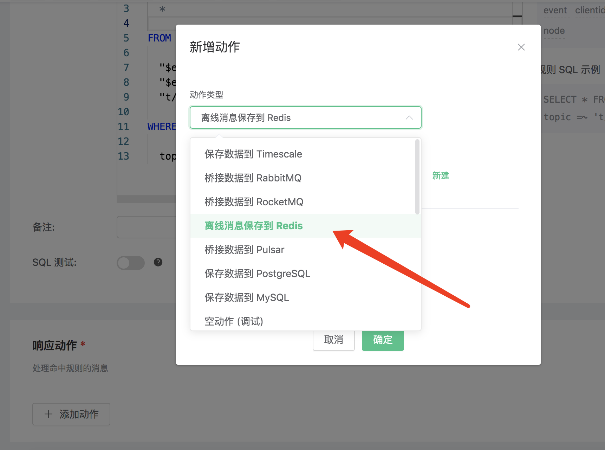

填写动作参数:

“离线消息保存到 Redis 动作需要两个参数：

1). Redis Key 超期的 TTL

2). 关联资源。现在资源下拉框为空，可以点击右上角的 “新建资源” 来创建一个 Redis 资源:


选择 Redis 单节点模式资源”。


填写资源配置:

   填写真实的 Redis 服务器地址，其他配置保持默认值，然后点击 “测试连接” 按钮，确保连接测试成功。

最后点击 “新建” 按钮。


返回响应动作界面，点击 “确认”。

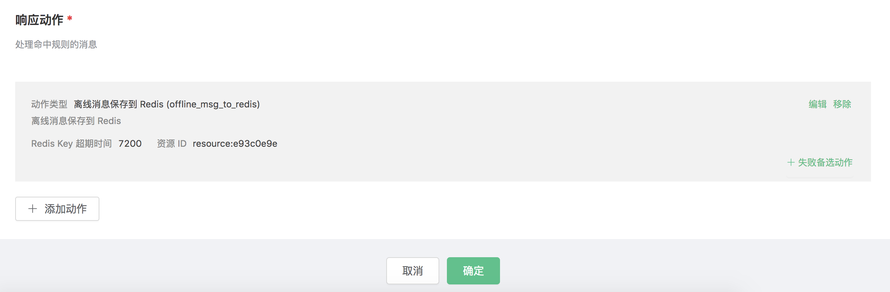

返回规则创建界面，点击 “新建”。

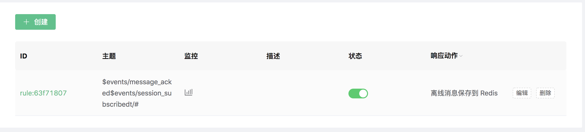

规则已经创建完成，通过 Dashboard 的 WebSocket 客户端发一条数据**(发布消息的QoS必须大于0)**:


消息发送后，通过 Redis CLI 查看到消息被保存到 Redis 里面:

```bash
$ redis-cli

KEYS mqtt:msg\*

hgetall Key
```


使用另外一个客户端，订阅主题 "t/1" **(订阅主题的QoS必须大于0，否则消息会被重复接收, 不支持主题通配符方式订阅获取离线消息)**:


订阅后马上接收到了保存到 Redis 里面的离线消息:


离线消息被接收后会在 Redis 中删除:

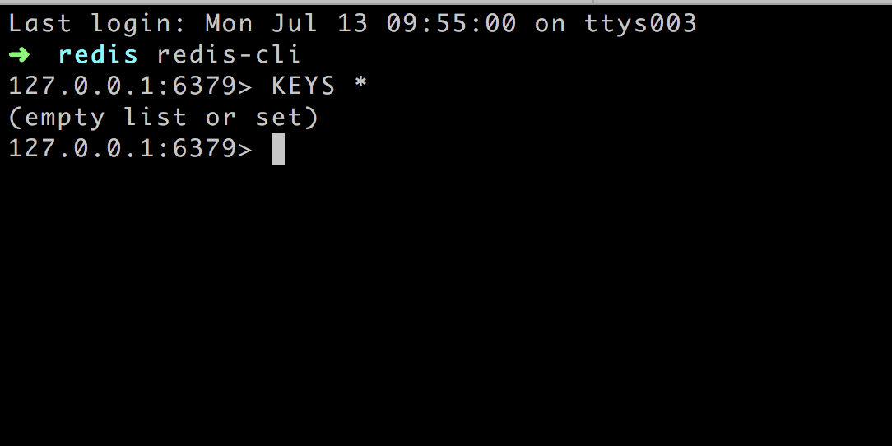

## 离线消息保存到 MySQL

搭建 MySQL 数据库，并设置用户名密码为 root/public，以 MacOS X 为例:
```bash
$ brew install mysql

$ brew services start mysql

$ mysql -u root -h localhost -p

ALTER USER 'root'@'localhost' IDENTIFIED BY 'public';
```

初始化 MySQL 数据库:
```bash
$ mysql -u root -h localhost -ppublic

create database mqtt;
```

创建 mqtt_msg 表:
```sql
DROP TABLE IF EXISTS `mqtt_msg`;
CREATE TABLE `mqtt_msg` (
  `id` int(11) unsigned NOT NULL AUTO_INCREMENT,
  `msgid` varchar(64) DEFAULT NULL,
  `topic` varchar(180) NOT NULL,
  `sender` varchar(64) DEFAULT NULL,
  `qos` tinyint(1) NOT NULL DEFAULT '0',
  `retain` tinyint(1) DEFAULT NULL,
  `payload` blob,
  `arrived` datetime NOT NULL,
  PRIMARY KEY (`id`),
  INDEX topic_index(`id`, `topic`)
) ENGINE=InnoDB DEFAULT CHARSET=utf8MB4;
```

::: danger

消息表结构不能修改，请使用上面SQL语句创建

:::

创建规则:

打开 [EMQ X Dashboard](http://127.0.0.1:18083/#/rules)，选择左侧的“规则”选项卡。

然后填写规则 SQL:

FROM说明

​	**t/#**: 发布者发布消息触发保存离线消息到MySQL

​	**$events/session_subscribed**: 订阅者订阅主题触发获取离线消息

​	**$events/message_acked**: 订阅者回复消息ACK后触发删除已经被接收的离线消息

```bash
SELECT * FROM "t/#", "$events/session_subscribed", "$events/message_acked" WHERE topic =~ 't/#'
```

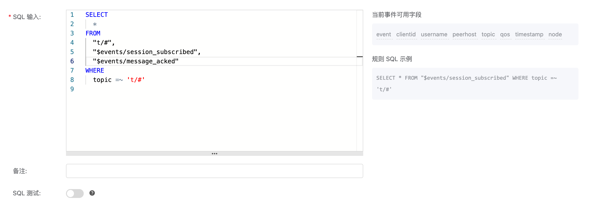

关联动作:

在“响应动作”界面选择“添加动作”，然后在“动作”下拉框里选择“离线消息保存到 MySQL”。

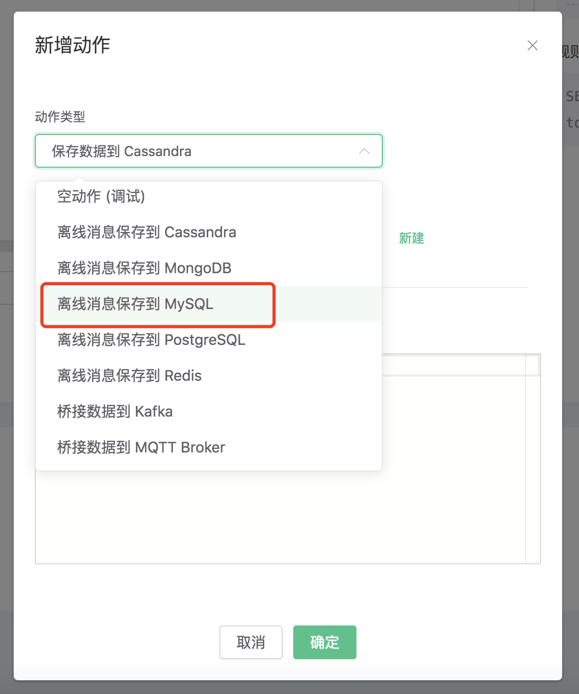


现在资源下拉框为空，可以点击右上角的 “新建” 来创建一个 MySQL 资源:

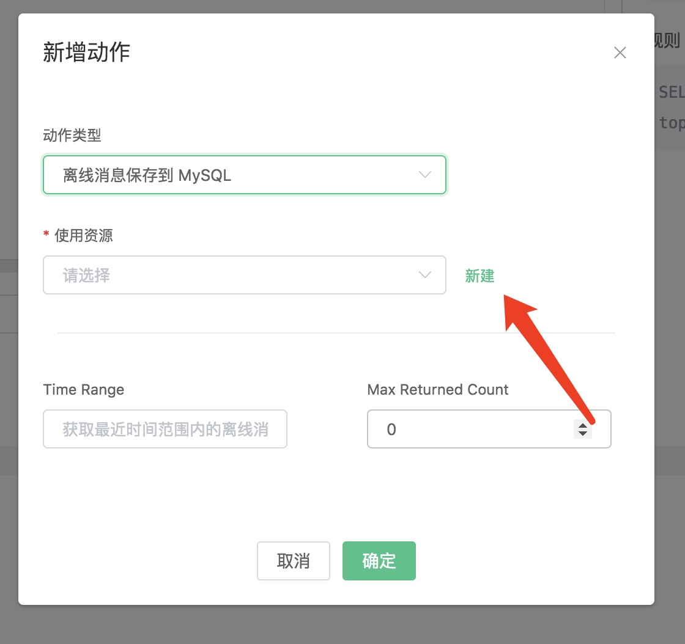

弹出一个“创建资源”对话框


填写资源配置:

填写真实的 MySQL 服务器地址，其他配置填写相应的值，然后点击 “测试连接” 按钮，确保连接测试成功。

最后点击 “确定” 按钮。


返回响应动作界面，点击 “确认”。


返回规则创建界面，点击 “创建”。

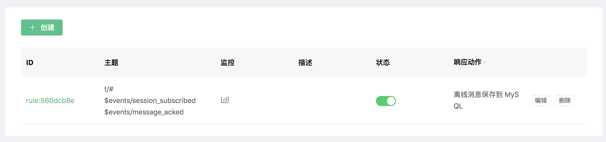

规则已经创建完成，通过 Dashboard 的 WebSocket 客户端发一条数据**(发布消息的QoS必须大于0)**:


消息发送后，通过 mysql 查看到消息被保存到 MySQL 里面:

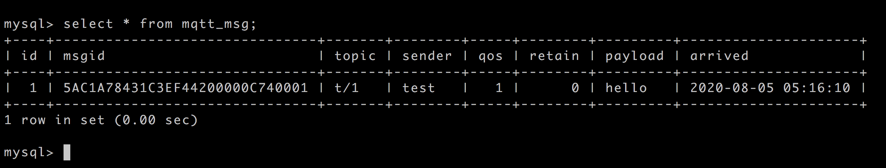

使用另外一个客户端，订阅主题 "t/1" (订阅主题的QoS必须大于0，否则消息会被重复接收):


订阅后马上接收到了保存到 MySQL 里面的离线消息:


离线消息被接收后会在 MySQL 中删除:

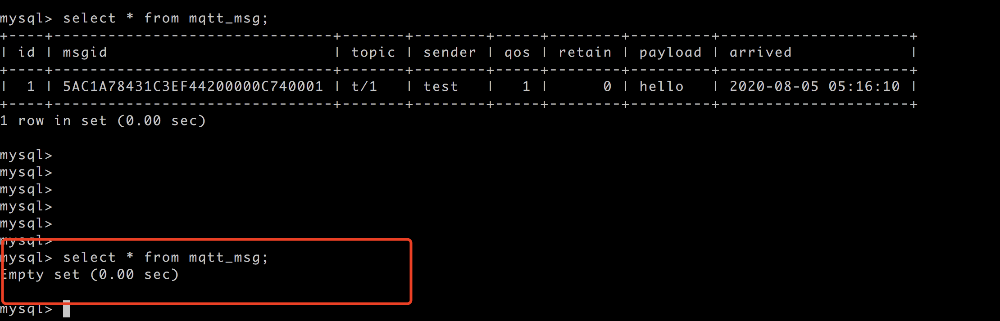


## 离线消息保存到 PostgreSQL

搭建 PostgreSQL 数据库，以 MacOS X 为例:
```bash
$ brew install postgresql
$ brew services start postgresql
```

创建 mqtt 数据库:

```
# 使用用户名 postgres 创建名为 'mqtt' 的数据库
$ createdb -U postgres mqtt

$ psql -U postgres mqtt

mqtt=> \dn;
List of schemas
Name  | Owner
--------+-------
public | postgres
(1 row)
```

创建 mqtt_msg 表:

```sql
$ psql -U postgres mqtt

CREATE TABLE mqtt_msg (
  id SERIAL8 primary key,
  msgid character varying(64),
  sender character varying(64),
  topic character varying(255),
  qos integer,
  retain integer,
  payload text,
  arrived timestamp without time zone
);
```

::: danger

消息表结构不能修改，请使用上面SQL语句创建

:::

创建规则:

打开 [EMQ X Dashboard](http://127.0.0.1:18083/#/rules)，选择左侧的“规则”选项卡。

然后填写规则 SQL:

FROM说明

​	**t/#**: 发布者发布消息触发保存离线消息到PostgreSQL

​	**$events/session_subscribed**: 订阅者订阅主题触发获取离线消息

​	**$events/message_acked**: 订阅者回复消息ACK后触发删除已经被接收的离线消息

```bash
SELECT * FROM "t/#", "$events/session_subscribed", "$events/message_acked" WHERE topic =~ 't/#'
```


关联动作:

在“响应动作”界面选择“添加动作”，然后在“动作”下拉框里选择“离线消息保存到 PostgreSQL”。

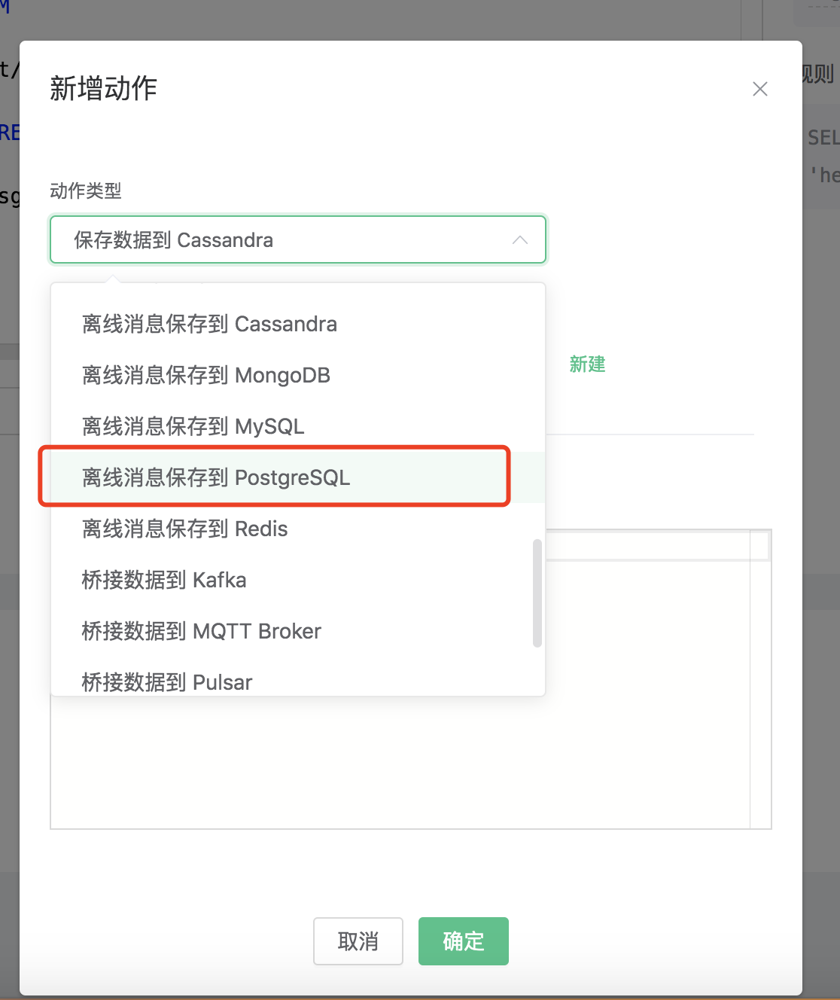


现在资源下拉框为空，可以点击右上角的 “新建” 来创建一个 PostgreSQL 资源:


弹出一个“创建资源”对话框

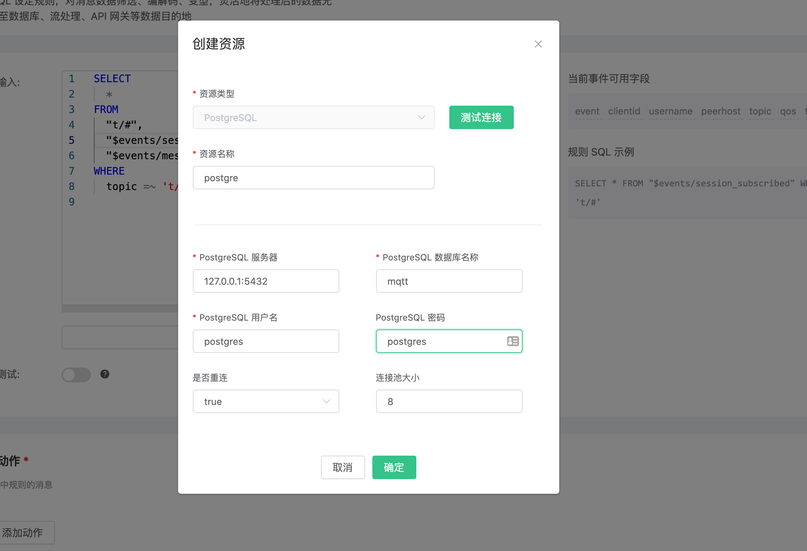

填写资源配置:

填写真实的 PostgreSQL 服务器地址，其他配置填写相应的值，然后点击 “测试连接” 按钮，确保连接测试成功。

最后点击 “确定” 按钮。

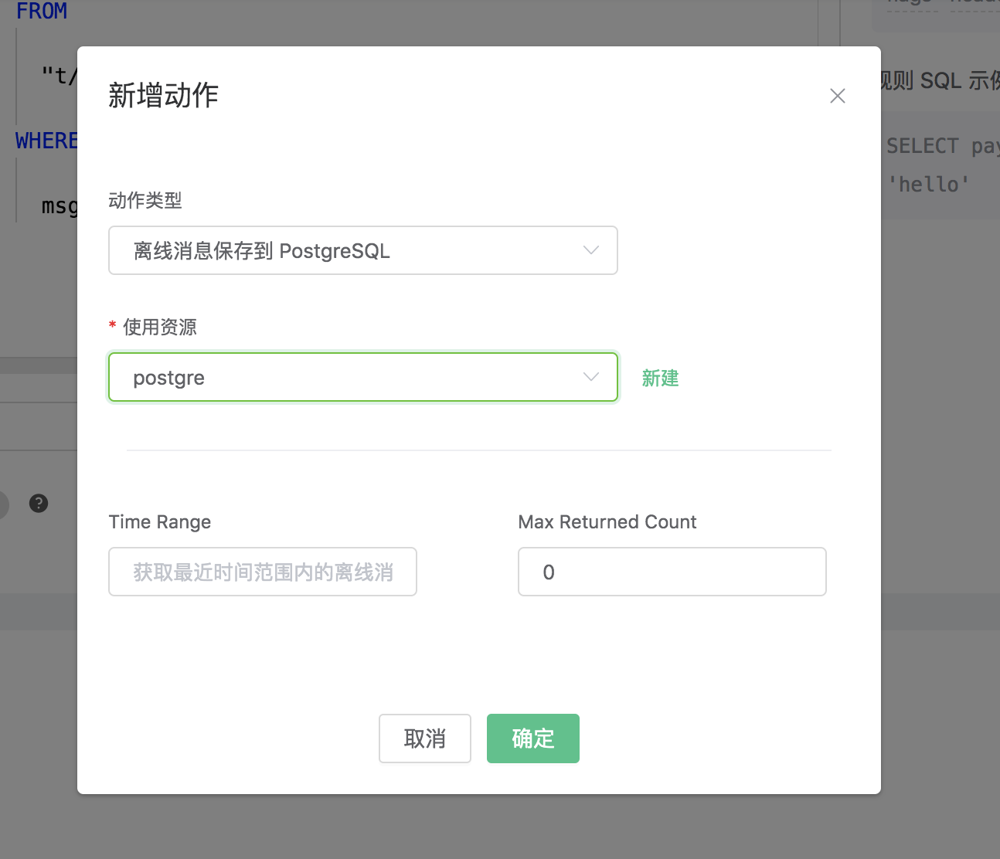

返回响应动作界面，点击 “确认”。


返回规则创建界面，点击 “创建”。

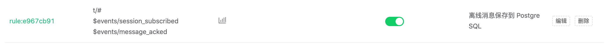

规则已经创建完成，通过 Dashboard 的 WebSocket 客户端发一条数据**(发布消息的QoS必须大于0)**:


消息发送后，通过 psql 查看到消息被保存到 PostgreSQL 里面:


使用另外一个客户端，订阅主题 "t/1" (订阅主题的QoS必须大于0，否则消息会被重复接收):


订阅后马上接收到了保存到 PostgreSQL 里面的离线消息:


离线消息被接收后会在 PostgreSQL 中删除:


## 离线消息保存到 Cassandra

搭建 Cassandra 数据库，并设置用户名密码为 root/public，以 MacOS X 为例:
```bash
$ brew install cassandra
## 修改配置，关闭匿名认证
$  vim /usr/local/etc/cassandra/cassandra.yaml

    authenticator: PasswordAuthenticator
    authorizer: CassandraAuthorizer

$ brew services start cassandra

## 创建 root 用户
$ cqlsh -ucassandra -pcassandra

create user root with password 'public' superuser;
```

初始化 Cassandra 表空间:
```bash
$ cqlsh -uroot -ppublic

CREATE KEYSPACE mqtt WITH replication = {'class': 'SimpleStrategy', 'replication_factor': '1'}  AND durable_writes = true;

```

创建 mqtt_msg 表:
```sql
CREATE TABLE mqtt.mqtt_msg (
    topic text,
    msgid text,
    arrived timestamp,
    payload text,
    qos int,
    retain int,
    sender text,
    PRIMARY KEY (topic, msgid)
) WITH CLUSTERING ORDER BY (msgid DESC)
    AND bloom_filter_fp_chance = 0.01
    AND caching = {'keys': 'ALL', 'rows_per_partition': 'NONE'}
    AND comment = ''
    AND compaction = {'class': 'org.apache.cassandra.db.compaction.SizeTieredCompactionStrategy', 'max_threshold': '32', 'min_threshold': '4'}
    AND compression = {'chunk_length_in_kb': '64', 'class': 'org.apache.cassandra.io.compress.LZ4Compressor'}
    AND crc_check_chance = 1.0
    AND dclocal_read_repair_chance = 0.1
    AND default_time_to_live = 0
    AND gc_grace_seconds = 864000
    AND max_index_interval = 2048
    AND memtable_flush_period_in_ms = 0
    AND min_index_interval = 128
    AND read_repair_chance = 0.0
    AND speculative_retry = '99PERCENTILE';

```

::: danger

消息表结构不能修改，请使用上面SQL语句创建

:::

创建规则:

打开 [EMQ X Dashboard](http://127.0.0.1:18083/#/rules)，选择左侧的“规则”选项卡。

然后填写规则 SQL:

FROM说明

​	**t/#**: 发布者发布消息触发保存离线消息到Cassandra

​	**$events/session_subscribed**: 订阅者订阅主题触发获取离线消息

​	**$events/message_acked**: 订阅者回复消息ACK后触发删除已经被接收的离线消息

```bash
SELECT * FROM "t/#", "$events/session_subscribed", "$events/message_acked" WHERE topic =~ 't/#'
```


关联动作:

在“响应动作”界面选择“添加动作”，然后在“动作”下拉框里选择“离线消息保存到 Cassandra ”。


现在资源下拉框为空，可以点击右上角的 “新建” 来创建一个 Cassandra 资源:

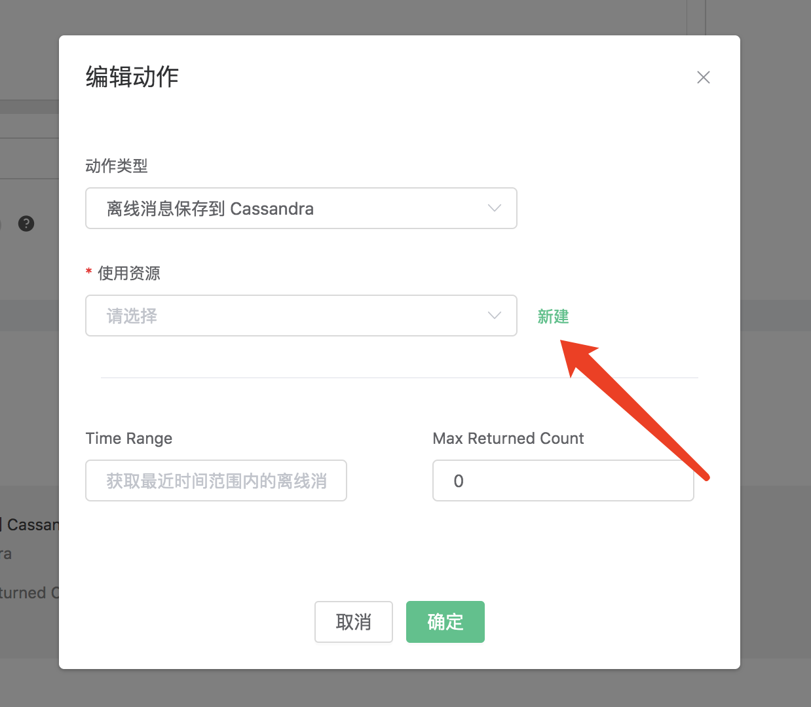

弹出一个“创建资源”对话框


填写资源配置:

填写真实的 Cassandra 服务器地址，其他配置填写相应的值，然后点击 “测试连接” 按钮，确保连接测试成功。

最后点击 “确定” 按钮。


返回响应动作界面，点击 “确认”。


返回规则创建界面，点击 “创建”。

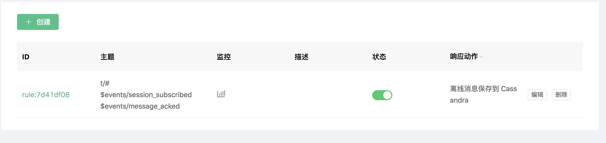

规则已经创建完成，通过 Dashboard 的 WebSocket 客户端发一条数据**(发布消息的QoS必须大于0)**:


消息发送后，通过 cqlsh 查看到消息被保存到 Cassandra 里面:

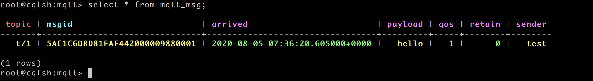

使用另外一个客户端，订阅主题 "t/1" (订阅主题的QoS必须大于0，否则消息会被重复接收):


订阅后马上接收到了保存到 Cassandra 里面的离线消息:


离线消息被接收后会在 Cassandra 中删除:


## 离线消息保存到 MongoDB

搭建 MongoDB 数据库，并设置用户名密码为 root/public，以 MacOS X 为例:
```bash
$ brew install mongodb
$ brew services start mongodb

## 新增 root/public 用户
$ use mqtt;
$ db.createUser({user: "root", pwd: "public", roles: [{role: "readWrite", db: "mqtt"}]});

## 修改配置，关闭匿名认证
$ vi /usr/local/etc/mongod.conf

    security:
    authorization: enabled

$ brew services restart mongodb
```

创建 mqtt_msg 表:
```bash
$ mongo 127.0.0.1/mqtt -uroot -ppublic
db.createCollection("mqtt_msg");
```

创建规则:

打开 [EMQ X Dashboard](http://127.0.0.1:18083/#/rules)，选择左侧的“规则”选项卡。

然后填写规则 SQL:

FROM说明

​	**t/#**: 发布者发布消息触发保存离线消息到MongoDB

​	**$events/session_subscribed**: 订阅者订阅主题触发获取离线消息

​	**$events/message_acked**: 订阅者回复消息ACK后触发删除已经被接收的离线消息

```bash
SELECT * FROM "t/#", "$events/session_subscribed", "$events/message_acked" WHERE topic =~ 't/#'
```


关联动作:

在“响应动作”界面选择“添加动作”，然后在“动作”下拉框里选择“离线消息保存到 MongoDB”。


现在资源下拉框为空，可以点击右上角的 “新建” 来创建一个 MongoDB 资源:


弹出一个“创建资源”对话框

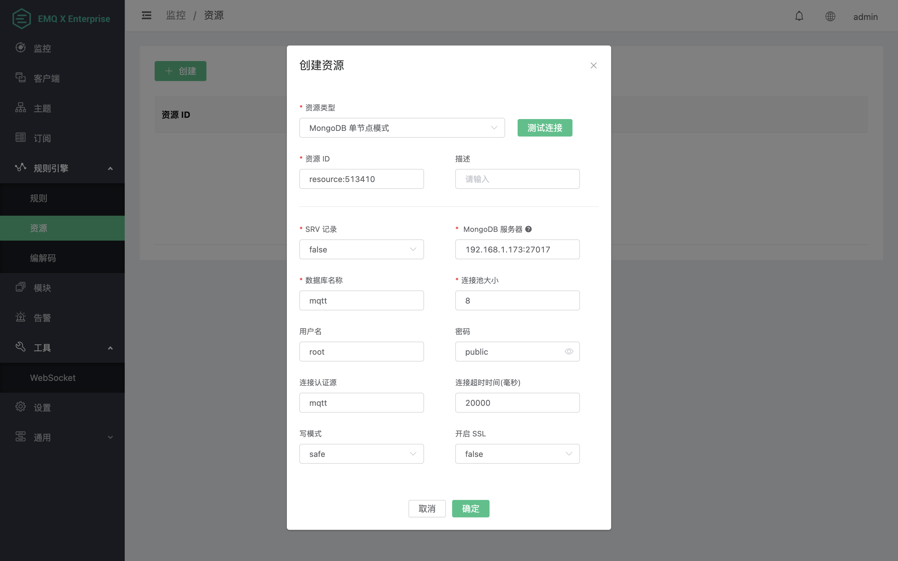

填写资源配置:

填写真实的 MongoDB 服务器地址，其他配置填写相应的值，然后点击 “测试连接” 按钮，确保连接测试成功。

最后点击 “确定” 按钮。

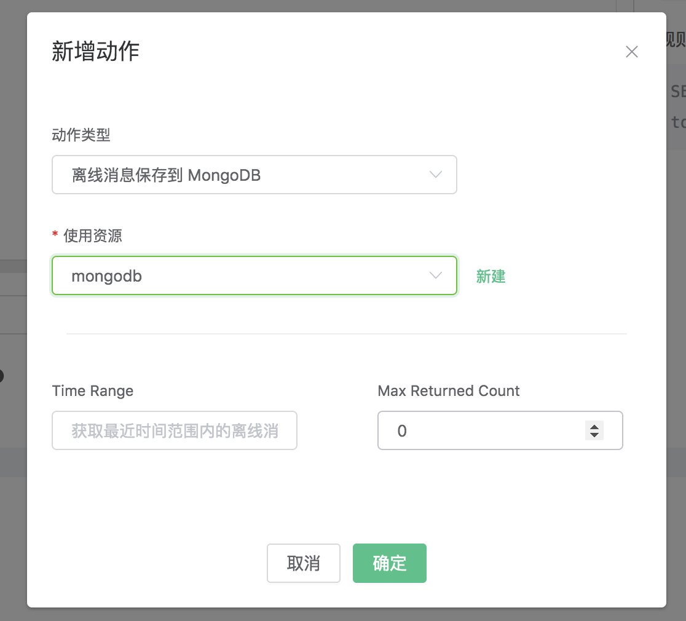

返回响应动作界面，点击 “确认”。


返回规则创建界面，点击 “创建”。


规则已经创建完成，通过 Dashboard 的 WebSocket 客户端发一条数据**(发布消息的QoS必须大于0)**:

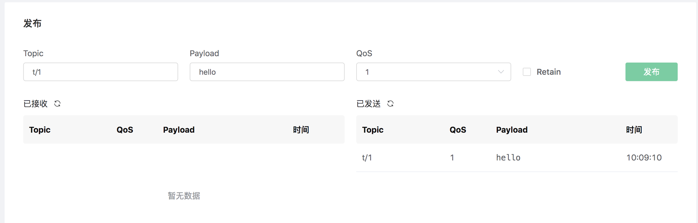

消息发送后，通过 mongo 查看到消息被保存到 MongoDB 里面:

```
db.mqtt_msg.find()
```


使用另外一个客户端，订阅主题 "t/1" (订阅主题的QoS必须大于0，否则消息会被重复接收):

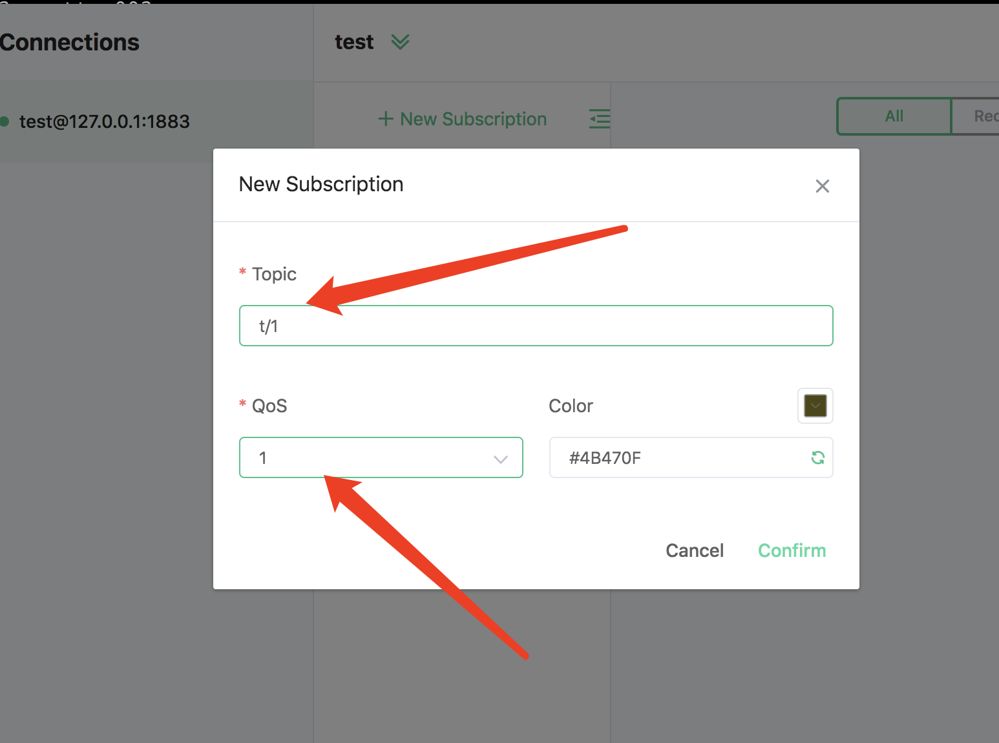

订阅后马上接收到了保存到 MongoDB 里面的离线消息:


离线消息被接收后会在 MongoDB 中删除:

