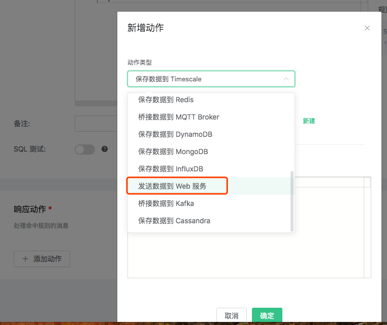
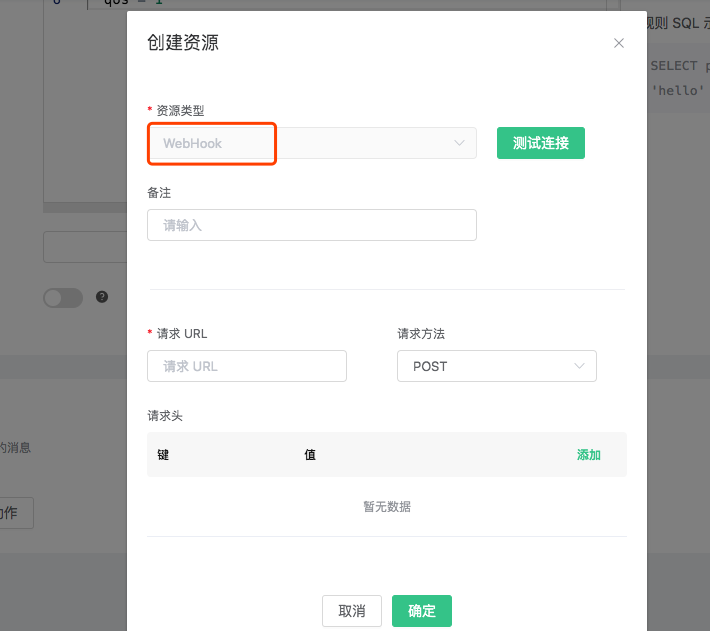
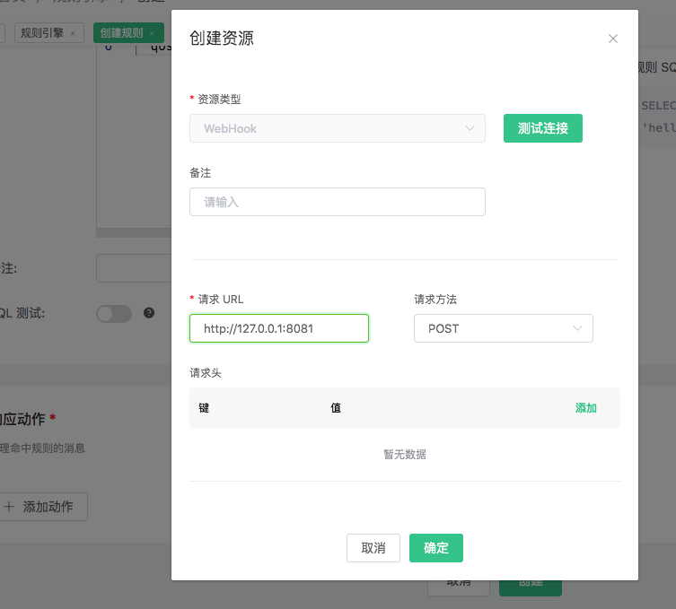
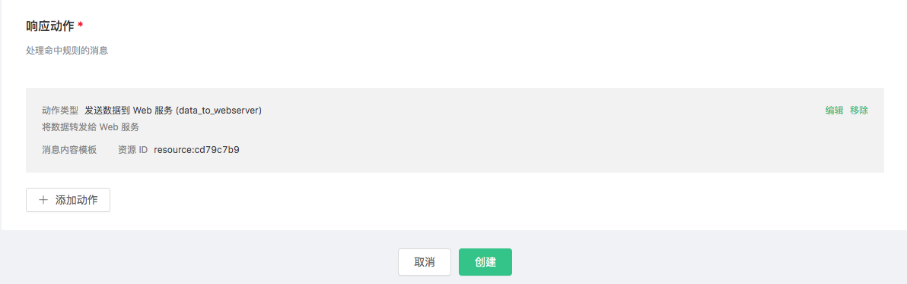

# 创建规则
## 使用 Dashboard 创建规则
### 创建 WebHook 规则
0. 搭建 Web 服务，这里使用 `nc` 命令做一个简单的Web 服务:

::: danger 
nc 命令在部分 Linux 操作系统上有问题，无法与 EMQ X 发起的 HTTP 请求连接握手成功，第 7 步可能无法正常进行。
:::

   ```bash
   $ while true; do echo -e "HTTP/1.1 200 OK\n\n $(date)" | nc -l 127.0.0.1 8081; done;
   ```

1. 创建规则:

   打开 [emqx dashboard](http://127.0.0.1:18083/#/rules)，选择左侧的 “规则” 选项卡。

   填写用以处理 t/# 主题的规则 SQL:

   ```sql
      SELECT
        *
      FROM
        "t/#"
      WHERE
        qos = 1
   ```

   

2. 关联动作:

   在 “响应动作” 界面选择 “添加”，然后在 “动作” 下拉框里选择 “发送数据到 Web 服务”。

  

3. 给动作关联资源:

   现在资源下拉框为空，可以点击右上角的 “新建资源” 来创建一个 WebHook 资源:

   

   选择 “WebHook 资源”:

   

4. 填写资源配置:

   填写 “请求 URL” 和请求头(可选):

   http://127.0.0.1:8081

   点击 “测试连接” 按钮，确保连接测试成功，最后点击 “新建” 按钮:

   

5. 返回响应动作界面，点击 “确认”。

   

6. 返回规则创建界面，点击 “新建”。

   

   规则已经创建完成，规则列表里展示出了新创建的规则:

   

7. 发一条消息:

      Topic: "t/1"

      QoS: 1

      Payload: "Hello web server"

  然后检查 Web 服务是否收到消息:

  

## 通过 CLI 创建简单规则
### 创建 Inspect 规则 
创建一个测试规则，当有消息发送到 't/a' 主题时，打印消息内容以及动作参数细节。

- 规则的筛选 SQL 语句为: SELECT * FROM "t/a";

- 动作是: "打印动作参数细节"，需要使用内置动作 'inspect'。

```bash
$ ./bin/emqx_ctl rules create \
  "SELECT * FROM \"t/a\"" \
  '[{"name":"inspect", "params": {"a": 1}}]' \
  -d 'Rule for debug'

Rule rule:803de6db created
```

上面的 CLI 命令创建了一个 ID 为 'Rule rule:803de6db' 的规则。

参数中前两个为必选参数:

- SQL 语句: SELECT \* FROM "t/a"
- 动作列表: \[{"name":"inspect", "params": {"a": 1}}\]。动作列表是用 JSON Array
  格式表示的。name 字段是动作的名字，params 字段是动作的参数。注意 `inspect` 动作是不需要绑定资源的。

最后一个可选参数，是规则的描述: 'Rule for debug'。

接下来当发送 "hello" 消息到主题 't/a' 时，上面创建的 "Rule rule:803de6db" 规则匹配成功，然后
"inspect" 动作被触发，将消息和参数内容打印到 emqx 控制台:

```bash
$ tail -f log/erlang.log.1

(emqx@127.0.0.1)1> [inspect]
    Selected Data: #{client_id => <<"shawn">>,event => 'message.publish',
                      flags => #{dup => false,retain => false},
                      id => <<"5898704A55D6AF4430000083D0002">>,
                      payload => <<"hello">>,
                      peername => <<"127.0.0.1:61770">>,qos => 1,
                      timestamp => 1558587875090,topic => <<"t/a">>,
                      username => undefined}
    Envs: #{event => 'message.publish',
            flags => #{dup => false,retain => false},
            from => <<"shawn">>,
            headers =>
                #{allow_publish => true,
                  peername => {{127,0,0,1},61770},
                  username => undefined},
            id => <<0,5,137,135,4,165,93,106,244,67,0,0,8,61,0,2>>,
            payload => <<"hello">>,qos => 1,
            timestamp => {1558,587875,89754},
            topic => <<"t/a">>}
    Action Init Params: #{<<"a">> => 1}
```

- `Selected Data` 列出的是消息经过 SQL 筛选、提取后的字段，由于我们用的是 `select
  *`，所以这里会列出所有可用的字段。
- `Envs` 是动作内部可以使用的环境变量。
- `Action Init Params` 是初始化动作的时候，我们传递给动作的参数。

### 创建 WebHook 规则 
创建一个规则，将所有发送自 client\_id='Steven' 的消息，转发到地址为 '<http://127.0.0.1:9910>' 的
Web 服务器:

- 规则的筛选条件为: SELECT username as u, payload FROM "t/a" where
  u='Steven';
- 动作是: "转发到地址为 '<http://127.0.0.1:9910>' 的 Web 服务";
- 资源类型是: web\_hook;
- 资源是: "到 url='<http://127.0.0.1:9910>' 的 WebHook 资源"。

0. 首先我们创建一个简易 Web 服务，这可以使用 `nc` 命令实现:

    ```bash
    $ while true; do echo -e "HTTP/1.1 200 OK\n\n $(date)" | nc -l 127.0.0.1 9910; done;
    ```

1. 使用 WebHook 类型创建一个资源，并配置资源参数 url:

    1). 列出当前所有可用的资源类型，确保 'web\_hook' 资源类型已存在:

    ```bash
    $ ./bin/emqx_ctl resource-types list

    resource_type(name='web_hook', provider='emqx_web_hook', params=#{...}}, on_create={emqx_web_hook_actions,on_resource_create}, description='WebHook Resource')
    ...
    ```

    2). 使用类型 'web\_hook' 创建一个新的资源，并配置 "url"="<http://127.0.0.1:9910>":

    ```bash
    $ ./bin/emqx_ctl resources create \
      'web_hook' \
      -c '{"url": "http://127.0.0.1:9910", "headers": {"token":"axfw34y235wrq234t4ersgw4t"}, "method": "POST"}'

    Resource resource:691c29ba created
    ```

    上面的 CLI 命令创建了一个 ID 为 '<resource:691c29ba>' 的资源，第一个参数是必选参数 -
    资源类型(web\_hook)。参数表明此资源指向 URL = "<http://127.0.0.1:9910>" 的
    Web 服务，方法为 POST，并且设置了一个 HTTP Header: "token"。

2. 然后创建规则，并选择规则的动作为 'data\_to\_webserver':

    1). 列出当前所有可用的动作，确保 'data\_to\_webserver' 动作已存在:

      ```bash
      $ ./bin/emqx_ctl rule-actions list

      action(name='data_to_webserver', app='emqx_web_hook', for='$any', types=[web_hook], params=#{'$resource' => ...}, title ='Data to Web Server', description='Forward Messages to Web Server')
      ...
      ```

    2). 创建规则，选择 data\_to\_webserver 动作，并通过 "$resource" 参数将
    <resource:691c29ba> 资源绑定到动作上:

      ```bash
      $ ./bin/emqx_ctl rules create \
        "SELECT username as u, payload FROM \"message.publish\" where u='Steven'" \
        '[{"name":"data_to_webserver", "params": {"$resource":  "resource:691c29ba"}}]' \
        -d "Forward publish msgs from steven to webserver"

      rule:26d84768
      ```

    上面的 CLI 命令与第一个例子里创建 Inspect 规则时类似，区别在于这里需要把刚才创建的资源
    '<resource:691c29ba>' 绑定到 'data\_to\_webserver'
    动作上。这个绑定通过给动作设置一个特殊的参数
    '$resource' 完成。'data\_to\_webserver' 动作的作用是将数据发送到指定的 Web 服务器。

3. 现在我们使用 username "Steven" 发送 "hello" 到任意主题，上面创建的规则就会被触发，Web Server 收到消息并回复 200 OK:

  ```bash
  $ while true; do echo -e "HTTP/1.1 200 OK\n\n $(date)" | nc -l 127.0.0.1 9910; done;

  POST / HTTP/1.1
  content-type: application/json
  content-length: 32
  te:
  host: 127.0.0.1:9910
  connection: keep-alive
  token: axfw34y235wrq234t4ersgw4t

  {"payload":"hello","u":"Steven"}
  ```
