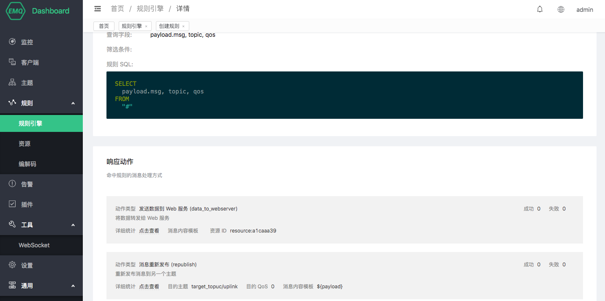
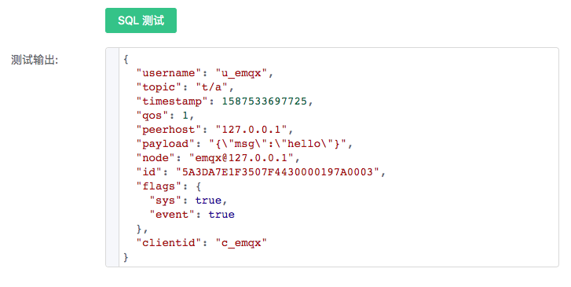

---
# 编写日期
date: 2020-02-20 17:46:13
# 作者 Github 名称
author: wivwiv, terry-xiaoyu
# 关键字
keywords:
# 描述
description:
# 分类
category:
# 引用
ref:
---

# 规则引擎

EMQ X Rule Engine (以下简称规则引擎) 用于配置 EMQ X 消息流与设备事件的处理、响应规则。规则引擎不仅提供了清晰、灵活的 "配置式" 的业务集成方案，简化了业务开发流程，提升用户易用性，降低业务系统与 EMQ X 的耦合度；也为 EMQ X 的私有功能定制提供了一个更优秀的基础架构。


EMQ X 在 **消息发布或事件触发** 时将触发规则引擎，满足触发条件的规则将执行各自的 SQL 语句筛选并处理消息和事件的上下文信息。

::: tip
适用版本: **EMQ X v3.1.0+**

兼容提示: EMQ X v4.0 对规则引擎 SQL 语法做出较大调整，v3.x 升级用户请参照 [迁移指南](./rule-engine.md#迁移指南) 进行适配。
:::


## EMQ X 规则引擎快速入门

此处包含规则引擎的简介与实战，演示使用规则引擎结合华为云 RDS 上的 MySQL 服务，进行物联网 MQTT 设备在线状态记录、消息存储入库。

从本视频中可以快速了解规则引擎解决的问题和基础使用方法。

<iframe style="width: 500px; height: 360px; margin: 10px auto" src="//player.bilibili.com/player.html?aid=927036281&bvid=BV19T4y1w7Nj&cid=233977851&page=1" scrolling="no" border="0" frameborder="no" framespacing="0" allowfullscreen="true"> </iframe>

## 消息发布

规则引擎借助响应动作可将特定主题的消息处理结果存储到数据库，发送到 HTTP Server，转发到消息队列 Kafka 或 RabbitMQ，重新发布到新的主题甚至是另一个 Broker 集群中，每个规则可以配置多个响应动作。

选择发布到 t/# 主题的消息，并筛选出全部字段：

```sql
SELECT * FROM "t/#"
```

选择发布到 t/a 主题的消息，并从 JSON 格式的消息内容中筛选出 "x" 字段：

```sql
SELECT payload.x as x FROM "t/a"
```

## 事件触发

规则引擎使用 **$events/** 开头的虚拟主题（**事件主题**）处理 EMQ X 内置事件，内置事件提供更精细的消息控制和客户端动作处理能力，可用在 QoS 1 QoS 2 的消息抵达记录、设备上下线记录等业务中。

选择客户端连接事件，筛选 Username 为 'emqx' 的设备并获取连接信息：

```sql
SELECT clientid, connected_at FROM "$events/client_connected" WHERE username = 'emqx'
```

规则引擎数据和 SQL 语句格式，[事件主题](#event-topics) 列表详细教程参见 [SQL 手册](#rule-sql)。

## 最小规则

规则描述了 **数据从哪里来**、**如何筛选并处理数据**、**处理结果到哪里去** 三个配置，即一条可用的规则包含三个要素：

- 触发事件：规则通过事件触发，触发时事件给规则注入事件的上下文信息（数据源），通过 SQL 的 FROM 子句指定事件类型；
- 处理规则（SQL）：使用 SELECT 子句 和 WHERE 子句以及内置处理函数， 从上下文信息中过滤和处理数据；
- 响应动作：如果有处理结果输出，规则将执行相应的动作，如持久化到数据库、重新发布处理后的消息、转发消息到消息队列等。一条规则可以配置多个响应动作。

如图所示是一条简单的规则，该条规则用于处理 **消息发布** 时的数据，将全部主题消息的 `msg` 字段，消息 `topic` 、`qos` 筛选出来，发送到 Web Server 与 /uplink 主题：



## 规则引擎典型应用场景举例

- 动作监听：智慧家庭智能门锁开发中，门锁会因为网络、电源故障、人为破坏等原因离线导致功能异常，使用规则引擎配置监听离线事件向应用服务推送该故障信息，可以在接入层实现第一时间的故障检测的能力；
- 数据筛选：车辆网的卡车车队管理，车辆传感器采集并上报了大量运行数据，应用平台仅关注车速大于 40 km/h 时的数据，此场景下可以使用规则引擎对消息进行条件过滤，向业务消息队列写入满足条件的数据；
- 消息路由：智能计费应用中，终端设备通过不同主题区分业务类型，可通过配置规则引擎将计费业务的消息接入计费消息队列并在消息抵达设备端后发送确认通知到业务系统，非计费信息接入其他消息队列，实现业务消息路由配置；
- 消息编解码：其他公共协议 / 私有 TCP 协议接入、工控行业等应用场景下，可以通过规则引擎的本地处理函数（可在 EMQ X 上定制开发）做二进制 / 特殊格式消息体的编解码工作；亦可通过规则引擎的消息路由将相关消息流向外部计算资源如函数计算进行处理（可由用户自行开发处理逻辑），将消息转为业务易于处理的 JSON 格式，简化项目集成难度、提升应用快速开发交付能力。

## 迁移指南

4.0 版本中规则引擎 SQL 语法更加易用，3.x 版本中所有事件 **FROM** 子句后面均需要指定事件名称，4.0 以后我们引入 **事件主题** 概念，默认情况下 **消息发布** 事件不再需要指定事件名称：

```sql
## 3.x 版本
## 需要指定事件名称进行处理
SELECT * FROM "t/#" WHERE topic =~ 't/#'

## 4.0 及以后版本
## 默认处理 message.publish 事件，FROM 后面直接填写 MQTT 主题
## 上述 SQL 语句等价于:
SELECT * FROM 't/#'

## 其他事件，FROM 后面填写事件主题
SELECT * FROM "$events/message_acked" where topic =~ 't/#'
SELECT * FROM "$events/client_connected"
```

::: tip
Dashboard 中提供了旧版 SQL 语法转换功能可以完成 SQL 升级迁移。
:::

## 规则引擎组成

使用 EMQ X 的规则引擎可以灵活地处理消息和事件。使用规则引擎可以方便地实现诸如将消息转换成指定格式，然后存入数据库表，或者发送到消息队列等。

与 EMQ X 规则引擎相关的概念包括: 规则(rule)、动作(action)、资源(resource) 和 资源类型(resource-type)。

规则、动作、资源的关系:
```
规则: {
    SQL 语句,
    动作列表: [
        {
            动作1,
            动作参数,
            绑定资源: {
                资源配置
            }
        },
        {
            动作2,
            动作参数,
            绑定资源: {
                资源配置
            }
         }
    ]
}
```
- 规则(Rule): 规则由 SQL 语句和动作列表组成。动作列表包含一个或多个动作及其参数。
- SQL 语句用于筛选或转换消息中的数据。
- 动作(Action) 是 SQL 语句匹配通过之后，所执行的任务。动作定义了一个针对数据的操作。
  动作可以绑定资源，也可以不绑定。例如，“inspect” 动作不需要绑定资源，它只是简单打印数据内容和动作参数。而 “data_to_webserver” 动作需要绑定一个 web_hook 类型的资源，此资源中配置了 URL。
- 资源(Resource): 资源是通过资源类型为模板实例化出来的对象，保存了与资源相关的配置(比如数据库连接地址和端口、用户名和密码等) 和系统资源(如文件句柄，连接套接字等)。
- 资源类型 (Resource Type): 资源类型是资源的静态定义，描述了此类型资源需要的配置项。

::: tip
动作和资源类型是由 emqx 或插件的代码提供的，不能通过 API 和 CLI 动态创建。
:::

## SQL 语句
### SQL 语法
**FROM、SELECT 和 WHERE 子句:**

规则引擎的 SQL 语句基本格式为:

```sql
SELECT <字段名> FROM <主题> [WHERE <条件>]
````

- ``FROM`` 子句将规则挂载到某个主题上
- ``SELECT`` 子句用于对数据进行变换，并选择出感兴趣的字段
- ``WHERE`` 子句用于对 SELECT 选择出来的某个字段施加条件过滤

**FOREACH、DO 和 INCASE 子句:**

如果对于一个数组数据，想针对数组中的每个元素分别执行一些操作并执行 Actions，需要使用 `FOREACH-DO-INCASE` 语法。其基本格式为:

```sql
FOREACH <字段名> [DO <条件>] [INCASE <条件>] FROM <主题> [WHERE <条件>]
````

- ``FOREACH`` 子句用于选择需要做 foreach 操作的字段，注意选择出的字段必须为数组类型
- ``DO`` 子句用于对 FOREACH 选择出来的数组中的每个元素进行变换，并选择出感兴趣的字段
- ``INCASE`` 子句用于对 DO 选择出来的某个字段施加条件过滤

其中 DO 和 INCASE 子句都是可选的。DO 相当于针对当前循环中对象的 SELECT 子句，而 INCASE 相当于针对当前循环中对象的 WHERE 语句。

### 事件和事件主题
规则引擎的 SQL 语句既可以处理消息(消息发布)，也可以处理事件(客户端上下线、客户端订阅等)。对于消息，FROM 子句后面直接跟主题名；对于事件，FROM 子句后面跟事件主题。

事件消息的主题以 `"$events/"` 开头，比如 `"$events/client_connected",` `"$events/session_subscribed"。`
如果想让 emqx 将事件消息发布出来，可以在 ``emqx_rule_engine.conf`` 文件中配置。

所有支持的事件及其可用字段详见: [规则事件](#rule-sql-events)。

### SQL 语句示例:
#### 基本语法举例

- 从 topic 为 "t/a" 的消息中提取所有字段:

```sql
SELECT * FROM "t/a"
```

- 从 topic 为 "t/a" 或 "t/b" 的消息中提取所有字段:

```sql
SELECT * FROM "t/a","t/b"
```

- 从 topic 能够匹配到 't/#' 的消息中提取所有字段。

```sql
SELECT * FROM "t/#"
```

- 从 topic 能够匹配到 't/#' 的消息中提取 qos, username 和 clientid 字段:

```sql
SELECT qos, username, clientid FROM "t/#"
```

- 从任意 topic 的消息中提取 username 字段，并且筛选条件为 username = 'Steven':

```sql
SELECT username FROM "#" WHERE username='Steven'
```

- 从任意 topic 的 JSON 消息体(payload) 中提取 x 字段，并创建别名 x 以便在 WHERE 子句中使用。WHERE 子句限定条件为 x = 1。下面这个 SQL 语句可以匹配到消息体 {"x": 1}, 但不能匹配到消息体 {"x": 2}:

```sql
SELECT payload as p FROM "#" WHERE p.x = 1
```

- 类似于上面的 SQL 语句，但嵌套地提取消息体中的数据，下面的 SQL 语句可以匹配到 JSON 消息体 {"x": {"y": 1}}:

```sql
SELECT payload as a FROM "#" WHERE a.x.y = 1
```

- 在 clientid = 'c1' 尝试连接时，提取其来源 IP 地址和端口号:

```sql
SELECT peername as ip_port FROM "$events/client_connected" WHERE clientid = 'c1'
```

- 筛选所有订阅 't/#' 主题且订阅级别为 QoS1 的 clientid:

```sql
SELECT clientid FROM "$events/session_subscribed" WHERE topic = 't/#' and qos = 1
```

- 筛选所有订阅主题能匹配到 't/#' 且订阅级别为 QoS1 的 clientid。注意与上例不同的是，这里用的是主题匹配操作符 **'=~'**，所以会匹配订阅 't' 或 't/+/a' 的订阅事件:

```sql
SELECT clientid FROM "$events/session_subscribed" WHERE topic =~ 't/#' and qos = 1
```

::: tip

- FROM 子句后面的主题需要用双引号 ``""`` 引起来。
- WHERE 子句后面接筛选条件，如果使用到字符串需要用单引号 ``''`` 引起来。
- FROM 子句里如有多个主题，需要用逗号 ``","`` 分隔。例如 SELECT * FROM "t/1", "t/2" 。
- 可以使用使用 ``"."`` 符号对 payload 进行嵌套选择。

:::

#### 遍历语法(FOREACH-DO-INCASE) 举例

假设有 ClientID 为 `c_steve`、主题为 `t/1` 的消息，消息体为 JSON 格式，其中 sensors 字段为包含多个 Object 的数组:

```json
{
    "date": "2020-04-24",
    "sensors": [
        {"name": "a", "idx":0},
        {"name": "b", "idx":1},
        {"name": "c", "idx":2}
    ]
}
```

**示例1: 要求将 sensors 里的各个对象，分别作为数据输入重新发布消息到 `sensors/${idx}` 主题，内容为 `${name}`。即最终规则引擎将会发出 3 条消息:**

1) 主题：sensors/0
   内容：a
2) 主题：sensors/1
   内容：b
3) 主题：sensors/2
   内容：c

要完成这个规则，我们需要配置如下动作：

- 动作类型：消息重新发布 (republish)
- 目的主题：sensors/${idx}
- 目的 QoS：0
- 消息内容模板：${name}

以及如下 SQL 语句：

```sql
FOREACH
    payload.sensors
FROM "t/#"
```

**示例解析:**

这个 SQL 中，FOREACH 子句指定需要进行遍历的数组 sensors，则选取结果为:

```json
[
  {
    "name": "a",
    "idx": 0
  },
  {
    "name": "b",
    "idx": 1
  },
  {
    "name": "c",
    "idx": 2
  }
]
```

FOREACH 语句将会对于结果数组里的每个对象分别执行 "消息重新发布" 动作，所以将会执行重新发布动作 3 次。

**示例2: 要求将 sensors 里的 `idx` 值大于或等于 1 的对象，分别作为数据输入重新发布消息到 `sensors/${idx}` 主题，内容为 `clientid=${clientid},name=${name},date=${date}`。即最终规则引擎将会发出 2 条消息:**

1) 主题：sensors/1
   内容：clientid=c_steve,name=b,date=2020-04-24
2) 主题：sensors/2
   内容：clientid=c_steve,name=c,date=2020-04-24

要完成这个规则，我们需要配置如下动作：

- 动作类型：消息重新发布 (republish)
- 目的主题：sensors/${idx}
- 目的 QoS：0
- 消息内容模板：clientid=${clientid},name=${name},date=${date}

以及如下 SQL 语句：

```sql
FOREACH
    payload.sensors
DO
    clientid,
    item.name as name,
    item.idx as idx
INCASE
    item.idx >= 1
FROM "t/#"
```

**示例解析:**

这个 SQL 中，FOREACH 子句指定需要进行遍历的数组 `sensors`; DO 子句选取每次操作需要的字段，这里我们选了外层的 `clientid` 字段，以及当前 sensor 对象的 `name` 和 `idx` 两个字段，注意 `item` 代表 sensors 数组中本次循环的对象。INCASE 子句是针对 DO 语句中字段的筛选条件，仅仅当 idx >= 1 满足条件。所以 SQL 的选取结果为:

```json
[
  {
    "name": "b",
    "idx": 1,
    "clientid": "c_emqx"
  },
  {
    "name": "c",
    "idx": 2,
    "clientid": "c_emqx"
  }
]
```

FOREACH 语句将会对于结果数组里的每个对象分别执行 "消息重新发布" 动作，所以将会执行重新发布动作 2 次。

在 DO 和 INCASE 语句里，可以使用 `item` 访问当前循环的对象，也可以通过在 FOREACH 使用 `as` 语法自定义一个变量名。所以本例中的 SQL 语句又可以写为：

```sql
FOREACH
    payload.sensors as s
DO
    clientid,
    s.name as name,
    s.idx as idx
INCASE
    s.idx >= 1
FROM "t/#"
```

**示例3: 在示例2 的基础上，去掉 clientid 字段 `c_steve` 中的 `c_` 前缀**

在 FOREACH 和 DO 语句中可以调用各类 SQL 函数，若要将 `c_steve` 变为 `steve`，则可以把例2 中的 SQL 改为：

```sql
FOREACH
    payload.sensors as s
DO
    nth(2, tokens(clientid,'_')) as clientid,
    s.name as name,
    s.idx as idx
INCASE
    s.idx >= 1
FROM "t/#"
```

另外，FOREACH 子句中也可以放多个表达式，只要最后一个表达式是指定要遍历的数组即可。比如我们将消息体改一下，sensors 外面多套一层 Object：

```json
{
    "date": "2020-04-24",
    "data": {
        "sensors": [
            {"name": "a", "idx":0},
            {"name": "b", "idx":1},
            {"name": "c", "idx":2}
        ]
    }
}
```

则 FOREACH 中可以在决定要遍历的数组之前把 data 选取出来：

```sql
FOREACH
    payload.data as data
    data.sensors as s
...
```

#### CASE-WHEN 语法示例

**示例1: 将消息中 x 字段的值范围限定在 0~7 之间。**

```sql
SELECT
  CASE WHEN payload.x < 0 THEN 0
       WHEN payload.x > 7 THEN 7
       ELSE payload.x
  END as x
FROM "t/#"
```

假设消息为:

```json
{"x": 8}
```

则上面的 SQL 输出为:

```json
{"x": 7}
```

#### 数组操作语法举例

**示例1: 创建一个数组，赋值给变量 a:**

```sql
SELECT
  [1,2,3] as a
FROM
  "t/#"
```

下标从 1 开始，上面的 SQL 输出为:

```json
{
  "a": [1, 2, 3]
}
```

**示例2: 从数组中取出第 N 个元素。下标为负数时，表示从数组的右边取:**

```sql
SELECT
  [1,2,3] as a,
  a[2] as b,
  a[-2] as c
FROM
  "t/#"
```

上面的 SQL 输出为:

```json
{
  "b": 2,
  "c": 2,
  "a": [1, 2, 3]
}
```

**示例3: 从 JSON 格式的 payload 中嵌套的获取值:**

```sql
SELECT
  payload.data[1].id as id
FROM
  "t/#"
```

假设消息为:

```json
{"data": [
    {"id": 1, "name": "steve"},
    {"id": 2, "name": "bill"}
]}
```

则上面的 SQL 输出为:

```json
{"id": 1}
```

**示例4: 数组范围(range)操作:**

```sql
SELECT
  [1..5] as a,
  a[2..4] as b
FROM
  "t/#"
```

上面的 SQL 输出为:

```json
{
  "b": [2, 3, 4],
  "a": [1, 2, 3, 4, 5]
}
```

**示例5: 使用下标语法修改数组中的某个元素:**

```sql
SELECT
  payload,
  'STEVE' as payload.data[1].name
FROM
  "t/#"
```

假设消息为:

```json
{"data": [
    {"id": 1, "name": "steve"},
    {"id": 2, "name": "bill"}
]}
```

则上面的 SQL 输出为:

```json
{
  "payload": {
    "data": [
      {"name": "STEVE", "id": 1},
      {"name": "bill", "id": 2}
    ]
  }
}
```

### FROM 子句可用的事件主题
| 事件主题名                    | 释义     |
| ----------------------------- | :------- |
| $events/message_delivered    | 消息投递 |
| $events/message_acked        | 消息确认 |
| $events/message_dropped      | 消息丢弃 |
| $events/client_connected     | 连接完成 |
| $events/client_disconnected  | 连接断开 |
| $events/session_subscribed   | 订阅     |
| $events/session_unsubscribed | 取消订阅 |

### SELECT 和 WHERE 子句可用的字段
SELECT 和 WHERE 子句可用的字段与事件的类型相关。其中 ``clientid``, ``username`` 和 ``event`` 是通用字段，每种事件类型都有。

#### 普通主题 (消息发布)

|        event        |  事件类型，固定为 "message.publish"   |
| :------------------ | :------------------------------------ |
| id                  | MQTT 消息 ID                          |
| clientid            | Client ID                             |
| username            | 用户名                                |
| payload             | MQTT 消息体                           |
| peerhost            | 客户端的 IPAddress                    |
| topic               | MQTT 主题                             |
| qos                 | MQTT 消息的 QoS                       |
| flags               | MQTT 消息的 Flags                     |
| headers             | MQTT 消息内部与流程处理相关的额外数据 |
| timestamp           | 事件触发时间 (ms)                     |
| publish_received_at | PUBLISH 消息到达 Broker 的时间 (ms)   |
| node                | 事件触发所在节点                      |

#### $events/message_delivered (消息投递)

|        event        | 事件类型，固定为 "message.delivered" |
| ------------------- | ------------------------------------ |
| id                  | MQTT 消息 ID                         |
| from_clientid       | 消息来源 Client ID                   |
| from_username       | 消息来源用户名                       |
| clientid            | 消息目的 Client ID                   |
| username            | 消息目的用户名                       |
| payload             | MQTT 消息体                          |
| peerhost            | 客户端的 IPAddress                   |
| topic               | MQTT 主题                            |
| qos                 | MQTT 消息的 QoS                      |
| flags               | MQTT 消息的 Flags                    |
| timestamp           | 事件触发时间 (ms)                    |
| publish_received_at | PUBLISH 消息到达 Broker 的时间 (ms)  |
| node                | 事件触发所在节点                     |

#### $events/message_acked (消息确认)

|        event        |  事件类型，固定为 "message.acked"   |
| :------------------ | :---------------------------------- |
| id                  | MQTT 消息 ID                        |
| from_clientid       | 消息来源 Client ID                  |
| from_username       | 消息来源用户名                      |
| clientid            | 消息目的 Client ID                  |
| username            | 消息目的用户名                      |
| payload             | MQTT 消息体                         |
| peerhost            | 客户端的 IPAddress                  |
| topic               | MQTT 主题                           |
| qos                 | MQTT 消息的 QoS                     |
| flags               | MQTT 消息的 Flags                   |
| timestamp           | 事件触发时间 (ms)                   |
| publish_received_at | PUBLISH 消息到达 Broker 的时间 (ms) |
| node                | 事件触发所在节点                    |

#### $events/message_dropped (消息丢弃)

|        event        | 事件类型，固定为 "message.dropped"  |
| :------------------ | :---------------------------------- |
| id                  | MQTT 消息 ID                        |
| reason              | 消息丢弃原因                        |
| clientid            | 消息目的 Client ID                  |
| username            | 消息目的用户名                      |
| payload             | MQTT 消息体                         |
| peerhost            | 客户端的 IPAddress                  |
| topic               | MQTT 主题                           |
| qos                 | MQTT 消息的 QoS                     |
| flags               | MQTT 消息的 Flags                   |
| timestamp           | 事件触发时间 (ms)                   |
| publish_received_at | PUBLISH 消息到达 Broker 的时间 (ms) |
| node                | 事件触发所在节点                    |

#### $events/client_connected (终端连接成功)

|      event      | 事件类型，固定为 "client.connected" |
| --------------- | :---------------------------------- |
| clientid        | 消息目的 Client ID                  |
| username        | 消息目的用户名                      |
| mountpoint      | 主题挂载点(主题前缀)                |
| peername        | 终端的 IPAddress 和 Port            |
| sockname        | emqx 监听的 IPAddress 和 Port       |
| proto_name      | 协议名字                            |
| proto_ver       | 协议版本                            |
| keepalive       | MQTT 保活间隔                       |
| clean_start     | MQTT clean_start                    |
| expiry_interval | MQTT Session 过期时间               |
| is_bridge       | 是否为 MQTT bridge 连接             |
| connected_at    | 终端连接完成时间 (s)                |
| timestamp       | 事件触发时间 (ms)                   |
| node            | 事件触发所在节点                    |

#### $events/client_disconnected (终端连接断开)

|      event      | 事件类型，固定为 "client.disconnected" |
| --------------- | :------------------------------------- |
| reason          | 终端连接断开原因                       |
| clientid        | 消息目的 Client ID                     |
| username        | 消息目的用户名                         |
| peername        | 终端的 IPAddress 和 Port               |
| sockname        | emqx 监听的 IPAddress 和 Port          |
| disconnected_at | 终端连接断开时间 (s)                   |
| timestamp       | 事件触发时间 (ms)                      |
| node            | 事件触发所在节点                       |

#### $events/session_subscribed (终端订阅成功)

|   event   | 事件类型，固定为 "session.subscribed" |
| --------- | ------------------------------------- |
| clientid  | 消息目的 Client ID                    |
| username  | 消息目的用户名                        |
| peerhost  | 客户端的 IPAddress                    |
| topic     | MQTT 主题                             |
| qos       | MQTT 消息的 QoS                       |
| timestamp | 事件触发时间 (ms)                     |
| node      | 事件触发所在节点                      |

#### $events/session_unsubscribed (取消终端订阅成功)

|   event   | 事件类型，固定为 "session.unsubscribed" |
| :-------- | :-------------------------------------- |
| clientid  | 消息目的 Client ID                      |
| username  | 消息目的用户名                          |
| peerhost  | 客户端的 IPAddress                      |
| topic     | MQTT 主题                               |
| qos       | MQTT 消息的 QoS                         |
| timestamp | 事件触发时间 (ms)                       |
| node      | 事件触发所在节点                        |

### SQL 关键字和符号
#### SELECT - FROM - WHERE 语句
SELECT 语句用于决定最终的输出结果里的字段。比如:

下面 SQL 的输出结果中将只有两个字段 "a" 和 "b":

```
SELECT a, b FROM "t/#"
```

WHERE 语句用于对本事件中可用字段，或 SELECT 语句中定义的字段进行条件过滤。比如:

```
# 选取 username 为 'abc' 的终端发来的消息，输出结果为所有可用字段:

SELECT * FROM "#" WHERE username = 'abc'

## 选取 clientid 为 'abc' 的终端发来的消息，输出结果将只有 cid 一个字段。
## 注意 cid 变量是在 SELECT 语句中定义的，故可在 WHERE 语句中使用:

SELECT clientid as cid FROM "#" WHERE cid = 'abc'

## 选取 username 为 'abc' 的终端发来的消息，输出结果将只有 cid 一个字段。
## 注意虽然 SELECT 语句中只选取了 cid 一个字段，所有消息发布事件中的可用字段 (比如 clientid, username 等) 仍然可以在 WHERE 语句中使用:

SELECT clientid as cid FROM "#" WHERE username = 'abc'

## 但下面这个 SQL 语句就不能工作了，因为变量 xyz 既不是消息发布事件中的可用字段，又没有在 SELECT 语句中定义:

SELECT clientid as cid FROM "#" WHERE xyz = 'abc'
```

FROM 语句用于选择事件来源。如果是消息发布则填写消息的主题，如果是事件则填写对应的事件主题。

#### 运算符号
| 函数名 |   函数作用            |   返回值   |     |
| ------ | ------------------- | ---------- | --- |
| `+`    | 加法，或字符串拼接     | 加和，或拼接之后的字符串 |     |
| `-`    | 减法                | 差值       |     |
| `*`    | 乘法                | 乘积       |     |
| `/`    | 除法                | 商值       |     |
| `div`  | 整数除法             | 整数商值   |     |
| `mod`  | 取模                 | 模         |     |
| `=`    | 比较两者是否完全相等。可用于比较变量和主题 | true/false |     |
| `=~`   | 比较主题(topic)是否能够匹配到主题过滤器(topic filter)。只能用于主题匹配 | true/false |     |

### SQL 语句中可用的函数
#### 数学函数

<table style="width:99%;">
<colgroup>
<col style="width: 12%" />
<col style="width: 23%" />
<col style="width: 41%" />
<col style="width: 20%" />
</colgroup>
<tbody>
<tr class="odd">
<td>函数名</td>
<td>函数作用</td>
<td>参数</td>
<td>返回值</td>
</tr>
<tr class="even">
<td>abs</td>
<td>绝对值</td>
<td><ol type="1">
<li>被操作数</li>
</ol></td>
<td>绝对值</td>
</tr>
<tr class="odd">
<td>cos</td>
<td>余弦</td>
<td><ol type="1">
<li>被操作数</li>
</ol></td>
<td>余弦值</td>
</tr>
<tr class="even">
<td>cosh</td>
<td>双曲余弦</td>
<td><ol type="1">
<li>被操作数</li>
</ol></td>
<td>双曲余弦值</td>
</tr>
<tr class="odd">
<td>acos</td>
<td>反余弦</td>
<td><ol type="1">
<li>被操作数</li>
</ol></td>
<td>反余弦值</td>
</tr>
<tr class="even">
<td>acosh</td>
<td>反双曲余弦</td>
<td><ol type="1">
<li>被操作数</li>
</ol></td>
<td>反双曲余弦值</td>
</tr>
<tr class="odd">
<td>sin</td>
<td>正弦</td>
<td><ol type="1">
<li>被操作数</li>
</ol></td>
<td>正弦值</td>
</tr>
<tr class="even">
<td>sinh</td>
<td>双曲正弦</td>
<td><ol type="1">
<li>被操作数</li>
</ol></td>
<td>双曲正弦值</td>
</tr>
<tr class="odd">
<td>asin</td>
<td>反正弦</td>
<td><ol type="1">
<li>被操作数</li>
</ol></td>
<td>值</td>
</tr>
<tr class="even">
<td>asinh</td>
<td>反双曲正弦</td>
<td><ol type="1">
<li>被操作数</li>
</ol></td>
<td>反双曲正弦值</td>
</tr>
<tr class="odd">
<td>tan</td>
<td>正切</td>
<td><ol type="1">
<li>被操作数</li>
</ol></td>
<td>正切值</td>
</tr>
<tr class="even">
<td>tanh</td>
<td>双曲正切</td>
<td><ol type="1">
<li>被操作数</li>
</ol></td>
<td>双曲正切值</td>
</tr>
<tr class="odd">
<td>atan</td>
<td>反正切</td>
<td><ol type="1">
<li>被操作数</li>
</ol></td>
<td>反正切值</td>
</tr>
<tr class="even">
<td>atanh</td>
<td>反双曲正切</td>
<td><ol type="1">
<li>被操作数</li>
</ol></td>
<td>反双曲正切值</td>
</tr>
<tr class="odd">
<td>ceil</td>
<td>上取整</td>
<td><ol type="1">
<li>被操作数</li>
</ol></td>
<td>整数值</td>
</tr>
<tr class="even">
<td>floor</td>
<td>下取整</td>
<td><ol type="1">
<li>被操作数</li>
</ol></td>
<td>整数值</td>
</tr>
<tr class="odd">
<td>round</td>
<td>四舍五入</td>
<td><ol type="1">
<li>被操作数</li>
</ol></td>
<td>整数值</td>
</tr>
<tr class="even">
<td>exp</td>
<td>幂运算</td>
<td><ol type="1">
<li>被操作数</li>
</ol></td>
<td>e 的 x 次幂</td>
</tr>
<tr class="odd">
<td>power</td>
<td>指数运算</td>
<td><ol type="1">
<li>左操作数 x 2. 右操作数 y</li>
</ol></td>
<td>x 的 y 次方</td>
</tr>
<tr class="even">
<td>sqrt</td>
<td>平方根运算</td>
<td><ol type="1">
<li>被操作数</li>
</ol></td>
<td>平方根</td>
</tr>
<tr class="odd">
<td>fmod</td>
<td>负点数取模函数</td>
<td><ol type="1">
<li>左操作数 2. 右操作数</li>
</ol></td>
<td>模</td>
</tr>
<tr class="even">
<td>log</td>
<td>以 e 为底对数</td>
<td><ol type="1">
<li>被操作数</li>
</ol></td>
<td>值</td>
</tr>
<tr class="odd">
<td>log10</td>
<td>以 10 为底对数</td>
<td><ol type="1">
<li>被操作数</li>
</ol></td>
<td>值</td>
</tr>
<tr class="even">
<td>log2</td>
<td>以 2 为底对数</td>
<td><ol type="1">
<li>被操作数</li>
</ol></td>
<td>值</td>
</tr>
</tbody>
</table>

#### 数据类型判断函数

<table>
<colgroup>
<col style="width: 9%" />
<col style="width: 35%" />
<col style="width: 6%" />
<col style="width: 48%" />
</colgroup>
<tbody>
<tr class="odd">
<td>函数名</td>
<td>函数作用</td>
<td>参数</td>
<td>返回值</td>
</tr>
<tr class="even">
<td>is_null</td>
<td>判断变量是否为空值</td>
<td><ol type="1">
<li>Data</li>
</ol></td>
<td>Boolean 类型的数据。如果为空值(undefined) 则返回 true，否则返回 false</td>
</tr>
<tr class="odd">
<td>is_not_null</td>
<td>判断变量是否为非空值</td>
<td><ol type="1">
<li>Data</li>
</ol></td>
<td>Boolean 类型的数据。如果为空值(undefined) 则返回 false，否则返回 true</td>
</tr>
<tr class="even">
<td>is_str</td>
<td>判断变量是否为 String 类型</td>
<td><ol type="1">
<li>Data</li>
</ol></td>
<td>Boolean 类型的数据。</td>
</tr>
<tr class="odd">
<td>is_bool</td>
<td>判断变量是否为 Boolean 类型</td>
<td><ol type="1">
<li>Data</li>
</ol></td>
<td>Boolean 类型的数据。</td>
</tr>
<tr class="even">
<td>is_int</td>
<td>判断变量是否为 Integer 类型</td>
<td><ol type="1">
<li>Data</li>
</ol></td>
<td>Boolean 类型的数据。</td>
</tr>
<tr class="odd">
<td>is_float</td>
<td>判断变量是否为 Float 类型</td>
<td><ol type="1">
<li>Data</li>
</ol></td>
<td>Boolean 类型的数据。</td>
</tr>
<tr class="even">
<td>is_num</td>
<td>判断变量是否为数字类型，包括 Integer 和 Float 类型</td>
<td><ol type="1">
<li>Data</li>
</ol></td>
<td>Boolean 类型的数据。</td>
</tr>
<tr class="odd">
<td>is_map</td>
<td>判断变量是否为 Map 类型</td>
<td><ol type="1">
<li>Data</li>
</ol></td>
<td>Boolean 类型的数据。</td>
</tr>
<tr class="even">
<td>is_array</td>
<td>判断变量是否为 Array 类型</td>
<td><ol type="1">
<li>Data</li>
</ol></td>
<td>Boolean 类型的数据。</td>
</tr>
</tbody>
</table>

#### 数据类型转换函数

<table>
<colgroup>
<col style="width: 9%" />
<col style="width: 29%" />
<col style="width: 9%" />
<col style="width: 51%" />
</colgroup>
<tbody>
<tr class="odd">
<td>函数名</td>
<td>函数作用</td>
<td>参数</td>
<td>返回值</td>
</tr>
<tr class="even">
<td>str</td>
<td>将数据转换为 String 类型</td>
<td><ol type="1">
<li>Data</li>
</ol></td>
<td>String 类型的数据。无法转换将会导致 SQL 匹配失败</td>
</tr>
<tr class="odd">
<td>str_utf8</td>
<td>将数据转换为 UTF-8 String 类型</td>
<td><ol type="1">
<li>Data</li>
</ol></td>
<td>UTF-8 String 类型的数据。无法转换将会导致 SQL 匹配失败</td>
</tr>
<tr class="even">
<td>bool</td>
<td>将数据转换为 Boolean 类型</td>
<td><ol type="1">
<li>Data</li>
</ol></td>
<td>Boolean 类型的数据。无法转换将会导致 SQL 匹配失败</td>
</tr>
<tr class="odd">
<td>int</td>
<td>将数据转换为整数类型</td>
<td><ol type="1">
<li>Data</li>
</ol></td>
<td>整数类型的数据。无法转换将会导致 SQL 匹配失败</td>
</tr>
<tr class="even">
<td>float</td>
<td>将数据转换为浮点型类型</td>
<td><ol type="1">
<li>Data</li>
</ol></td>
<td>浮点型类型的数据。无法转换将会导致 SQL 匹配失败</td>
</tr>
<tr class="odd">
<td>map</td>
<td>将数据转换为 Map 类型</td>
<td><ol type="1">
<li>Data</li>
</ol></td>
<td>Map 类型的数据。无法转换将会导致 SQL 匹配失败</td>
</tr>
</tbody>
</table>

#### 字符串函数

| 函数名   |   函数作用    |    参数     |       返回值       |       举例       |
| ------- | ------------ | ----------- | ------------------ | ----------------- |
| lower   | 转为小写      | 1. 原字符串     | 小写字符串         |` 1. lower('AbC') = 'abc'`<br/><br/>`2. lower('abc') = 'abc' `|
| upper   | 转为大写      | 1. 原字符串     | 大写字符串         |` 1. upper('AbC') = 'ABC'`<br/><br/>`2. lower('ABC') = 'ABC' `|
| trim    | 去掉左右空格  | 1. 原字符串     | 去掉空格后的字符串 |` 1. trim(' hello  ') = 'hello' `|
| ltrim   | 去掉左空格    | 1. 原字符串     | 去掉空格后的字符串 |` 1. ltrim(' hello  ') = 'hello  '`|
| rtrim   | 去掉右空格    | 1. 原字符串     | 去掉空格后的字符串 |` 1. rtrim(' hello  ') = ' hello'`|
| reverse | 字符串反转    | 1. 原字符串     | 翻转后的字符串 |` 1. reverse('hello') = 'olleh' `|
| strlen  | 取字符串长度    | 1. 原字符串     | 整数值，字符长度 |` 1. strlen('hello') = 5 `|
| substr  | 取字符的子串  | 1. 原字符串 2. 起始位置. 注意: 下标从 0 开始 | 子串 |` 1. substr('abcdef', 2) = 'cdef' `|
| substr  | 取字符的子串  | 1. 原字符串 2. 起始位置 3. 要取出的子串长度. 注意: 下标从 0 开始 | 子串 |` 1. substr('abcdef', 2, 3) = 'cde' `|
| split   | 字符串分割    | 1. 原字符串 2. 分割符子串 | 分割后的字符串数组 | `1. split('a/b/ c', '/') = ['a', 'b', ' c']` |
| split   | 字符串分割, 只查找左边第一个分隔符 | 1. 原字符串 2. 分割符子串 3. 'leading' | 分割后的字符串数组 | `1. split('a/b/ c', '/', 'leading') = ['a', 'b/ c']` |
| split   | 字符串分割, 只查找右边第一个分隔符 | 1. 原字符串 2. 分割符子串 3. 'trailing' | 分割后的字符串数组 | `1. split('a/b/ c', '/', 'trailing') = ['a/b', ' c']` |
| concat   | 字符串拼接  | 1. 左字符串 2. 右符子串 | 拼接后的字符串 | `1. concat('a', '/bc') = 'a/bc'`<br/><br/>`2. 'a' + '/bc' = 'a/bc'` |
| tokens   | 字符串分解(按照指定字符串符分解)  | 1. 输入字符串 2. 分割符或字符串 | 分解后的字符串数组 | `1. tokens(' a/b/ c', '/') = [' a', 'b', ' c']`<br/><br/>`2. tokens(' a/b/ c', '/ ') = ['a', 'b', 'c']`<br/><br/>`3. tokens(' a/b/ c\n', '/ ') = ['a', 'b', 'c\n']` |
| tokens   | 字符串分解(按照指定字符串和换行符分解)  | 1. 输入字符串 2. 分割符或字符串 3. 'nocrlf' | 分解后的字符串数组 | `1. tokens(' a/b/ c\n', '/ ', 'nocrlf') = ['a', 'b', 'c']`<br/><br/>`2. tokens(' a/b/ c\r\n', '/ ', 'nocrlf') = ['a', 'b', 'c']` |
| sprintf   | 字符串格式化, 格式字符串的用法详见 https://erlang.org/doc/man/io.html#fwrite-1 里的 Format 部分 | 1. 格式字符串 2,3,4... 参数列表。参数个数不定 | 分解后的字符串数组 | `1. sprintf('hello, ~s!', 'steve') = 'hello, steve!'`<br/><br/>`2. sprintf('count: ~p~n', 100) = 'count: 100\n'` |
| pad   | 字符串补足长度，补空格，从尾部补足  | 1. 原字符串 2. 字符总长度 | 补足后的字符串 | `1. pad('abc', 5) = 'abc  '` |
| pad   | 字符串补足长度，补空格，从尾部补足  | 1. 原字符串 2. 字符总长度 3. 'trailing' | 补足后的字符串 | `1. pad('abc', 5, 'trailing') = 'abc  '` |
| pad   | 字符串补足长度，补空格，从两边补足  | 1. 原字符串 2. 字符总长度 3. 'both' | 补足后的字符串 | `1. pad('abc', 5, 'both') = ' abc '` |
| pad   | 字符串补足长度，补空格，从头部补足  | 1. 原字符串 2. 字符总长度 3. 'leading' | 补足后的字符串 | `1. pad('abc', 5, 'leading') = '  abc'` |
| pad   | 字符串补足长度，补指定字符，从尾部补足  | 1. 原字符串 2. 字符总长度 3. 'trailing' 4. 指定用于补足的字符 | 补足后的字符串 |  `1. pad('abc', 5, 'trailing', '*') = 'abc**'`<br/><br/>`2. pad('abc', 5, 'trailing', '*#') = 'abc*#*#'` |
| pad   | 字符串补足长度，补指定字符，从两边补足  | 1. 原字符串 2. 字符总长度 3. 'both' 4. 指定用于补足的字符 | 补足后的字符串 |  `1. pad('abc', 5, 'both', '*') = '*abc*'`<br/><br/>`2. pad('abc', 5, 'both', '*#') = '*#abc*#'` |
| pad   | 字符串补足长度，补指定字符，从头部补足  | 1. 原字符串 2. 字符总长度 3. 'leading' 4. 指定用于补足的字符 | 补足后的字符串 | `1. pad('abc', 5, 'leading', '*') = '**abc'`<br/><br/>`2. pad('abc', 5, 'leading', '*#') = '*#*#abc'` |
| replace | 替换字符串中的某子串，查找所有匹配子串替换  | 1. 原字符串 2. 要被替换的子串 3. 指定用于替换的字符串 | 替换后的字符串 | `1. replace('ababef', 'ab', 'cd') = 'cdcdef'` |
| replace | 替换字符串中的某子串，查找所有匹配子串替换  | 1. 原字符串 2. 要被替换的子串 3. 指定用于替换的字符串 4. 'all' | 替换后的字符串 | `1. replace('ababef', 'ab', 'cd', 'all') = 'cdcdef'` |
| replace | 替换字符串中的某子串，从尾部查找第一个匹配子串替换  | 1. 原字符串 2. 要被替换的子串 3. 指定用于替换的字符串 4. 'trailing' | 替换后的字符串 | `1. replace('ababef', 'ab', 'cd', 'trailing') = 'abcdef'` |
| replace | 替换字符串中的某子串，从头部查找第一个匹配子串替换  | 1. 原字符串 2. 要被替换的子串 3. 指定用于替换的字符串 4. 'leading' | 替换后的字符串 | `1. replace('ababef', 'ab', 'cd', 'leading') = 'cdabef'` |
| regex_match | 判断字符串是否与某正则表达式匹配  | 1. 原字符串 2. 正则表达式 | true 或 false | `1. regex_match('abc123', '[a-zA-Z1-9]*') = true` |
| regex_replace | 替换字符串中匹配到某正则表达式的子串  | 1. 原字符串 2. 正则表达式 3. 指定用于替换的字符串 | 替换后的字符串 | `1. regex_replace('ab1cd3ef', '[1-9]', '[&]') = 'ab[1]cd[3]ef'`<br/><br/>`2. regex_replace('ccefacef', 'c+', ':') = ':efa:ef'` |
| ascii | 返回字符对应的 ASCII 码  | 1. 字符 | 整数值，字符对应的 ASCII 码 | `1. ascii('a') = 97` |
| find | 查找并返回字符串中的某个子串，从头部查找  | 1. 原字符串 2. 要查找的子串 | 查抄到的子串，如找不到则返回空字符串 | `1. find('eeabcabcee', 'abc') = 'abcabcee'` |
| find | 查找并返回字符串中的某个子串，从头部查找  | 1. 原字符串 2. 要查找的子串 3. 'leading' | 查抄到的子串，如找不到则返回空字符串 | `1. find('eeabcabcee', 'abc', 'leading') = 'abcabcee'` |
| find | 查找并返回字符串中的某个子串，从尾部查找  | 1. 原字符串 2. 要查找的子串 3. 'trailing' | 查抄到的子串，如找不到则返回空字符串 | `1. find('eeabcabcee', 'abc', 'trailing') = 'abcee'` |

#### Map 函数

<table>
<colgroup>
<col style="width: 6%" />
<col style="width: 34%" />
<col style="width: 22%" />
<col style="width: 35%" />
</colgroup>
<tbody>
<tr class="odd">
<td>函数名</td>
<td>函数作用</td>
<td>参数</td>
<td>返回值</td>
</tr>
<tr class="even">
<td>map_get</td>
<td>取 Map 中某个 Key 的值，如果没有则返回空值</td>
<td><ol type="1">
<li>Key 2. Map</li>
</ol></td>
<td>Map 中某个 Key 的值。支持嵌套的 Key，比如 "a.b.c"</td>
</tr>
<tr class="odd">
<td>map_get</td>
<td>取 Map 中某个 Key 的值，如果没有则返回指定默认值</td>
<td><ol type="1">
<li>Key 2. Map 3. Default Value</li>
</ol></td>
<td>Map 中某个 Key 的值。支持嵌套的 Key，比如 "a.b.c"</td>
</tr>
<tr class="even">
<td>map_put</td>
<td>向 Map 中插入值</td>
<td><ol type="1">
<li>Key 2. Value 3. Map</li>
</ol></td>
<td>插入后的 Map。支持嵌套的 Key，比如 "a.b.c"</td>
</tr>
</tbody>
</table>

#### 数组函数

<table>
<colgroup>
<col style="width: 9%" />
<col style="width: 47%" />
<col style="width: 31%" />
<col style="width: 12%" />
</colgroup>
<tbody>
<tr class="odd">
<td>函数名</td>
<td>函数作用</td>
<td>参数</td>
<td>返回值</td>
</tr>
<tr class="even">
<td>nth</td>
<td>取第 n 个元素，下标从 1 开始</td>
<td><ol type="1">
<li>原数组</li>
</ol></td>
<td>第 n 个元素</td>
</tr>
<tr class="odd">
<td>length</td>
<td>获取数组的长度</td>
<td><ol type="1">
<li>原数组</li>
</ol></td>
<td>数组长度</td>
</tr>
<tr class="even">
<td>sublist</td>
<td>取从第一个元素开始、长度为 len 的子数组。下标从 1 开始</td>
<td><ol type="1">
<li>长度 len 2. 原数组</li>
</ol></td>
<td>子数组</td>
</tr>
<tr class="odd">
<td>sublist</td>
<td>取从第 n 个元素开始、长度为 len 的子数组。下标从 1 开始</td>
<td><ol type="1">
<li>起始位置 n 2. 长度 len 3. 原数组</li>
</ol></td>
<td>子数组</td>
</tr>
<tr class="even">
<td>first</td>
<td>取第 1 个元素。下标从 1 开始</td>
<td><ol type="1">
<li>原数组</li>
</ol></td>
<td>第 1 个元素</td>
</tr>
<tr class="odd">
<td>last</td>
<td>取最后一个元素。</td>
<td><ol type="1">
<li>原数组</li>
</ol></td>
<td>最后一个元素</td>
</tr>
<tr class="even">
<td>contains</td>
<td>判断数据是否在数组里面</td>
<td><ol type="1">
<li>数据 2. 原数组</li>
</ol></td>
<td>Boolean 值</td>
</tr>
</tbody>
</table>

#### 哈希函数

<table style="width:99%;">
<colgroup>
<col style="width: 12%" />
<col style="width: 20%" />
<col style="width: 13%" />
<col style="width: 16%" />
</colgroup>
<tbody>
<tr class="odd">
<td>函数名</td>
<td>函数作用</td>
<td>参数</td>
<td>返回值</td>
</tr>
<tr class="even">
<td>md5</td>
<td>求 MD5 值</td>
<td><ol type="1">
<li>数据</li>
</ol></td>
<td>MD5 值</td>
</tr>
<tr class="odd">
<td>sha</td>
<td>求 SHA 值</td>
<td><ol type="1">
<li>数据</li>
</ol></td>
<td>SHA 值</td>
</tr>
<tr class="even">
<td>sha256</td>
<td>求 SHA256 值</td>
<td><ol type="1">
<li>数据</li>
</ol></td>
<td>SHA256 值</td>
</tr>
</tbody>
</table>

#### 编解码函数

<table>
<colgroup>
<col style="width: 16%" />
<col style="width: 14%" />
<col style="width: 52%" />
<col style="width: 16%" />
</colgroup>
<tbody>
<tr class="odd">
<td>函数名</td>
<td>函数作用</td>
<td>参数</td>
<td>返回值</td>
</tr>
<tr class="even">
<td>base64_encode</td>
<td>BASE64 编码</td>
<td><ol type="1">
<li>数据</li>
</ol></td>
<td>BASE64 字符串</td>
</tr>
<tr class="odd">
<td>base64_decode</td>
<td>BASE64 解码</td>
<td><ol type="1">
<li>BASE64 字符串</li>
</ol></td>
<td>数据</td>
</tr>
<tr class="even">
<td>json_encode</td>
<td>JSON 编码</td>
<td><ol type="1">
<li>JSON 字符串</li>
</ol></td>
<td>内部 Map</td>
</tr>
<tr class="odd">
<td>json_decode</td>
<td>JSON 解码</td>
<td><ol type="1">
<li>内部 Map</li>
</ol></td>
<td>JSON 字符串</td>
</tr>
<tr class="even">
<td>schema_encode</td>
<td>Schema 编码</td>
<td><ol type="1">
<li>Schema ID 2. 内部 Map</li>
</ol></td>
<td>数据</td>
</tr>
<tr class="odd">
<td>schema_encode</td>
<td>Schema 编码</td>
<td><ol type="1">
<li>Schema ID 2. 内部 Map 3. Protobuf Message 名</li>
</ol></td>
<td>数据</td>
</tr>
<tr class="even">
<td>schema_decode</td>
<td>Schema 解码</td>
<td><ol type="1">
<li>Schema ID 2. 数据</li>
</ol></td>
<td>内部 Map</td>
</tr>
<tr class="odd">
<td>schema_decode</td>
<td>Schema 解码</td>
<td><ol type="1">
<li>Schema ID 2. 数据 3. Protobuf Message 名</li>
</ol></td>
<td>内部 Map</td>
</tr>
</tbody>
</table>

### 在 Dashboard 中测试 SQL 语句
Dashboard 界面提供了 SQL 语句测试功能，通过给定的 SQL 语句和事件参数，展示 SQL 测试结果。

1.  在创建规则界面，输入 **规则SQL**，并启用 **SQL 测试** 开关:

    

2.  修改模拟事件的字段，或者使用默认的配置，点击 **测试** 按钮:

    

3.  SQL 处理后的结果将在 **测试输出** 文本框里展示:

    
