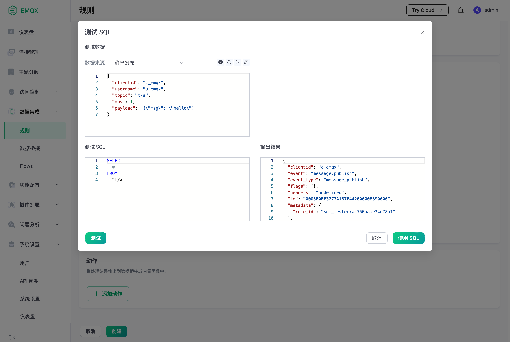

# 规则引擎简介

EMQX 规则引擎用于配置消息与事件的处理规则。规则引擎提供了清晰、灵活的 "配置式" 的数据集成方案，无需代码开发即可处理简单的数据业务。使用规则引擎结合数据桥接功能，可快速对接外部数据系统，实现物联网数据的移动和处理。


## 规则引擎组成

规则描述了 **数据从哪里来**、**如何筛选并处理数据**、**处理结果到哪里去** 三个方面：

- 消息或事件：通过 SQL 的 FROM 子句指定消息主题或者事件类型；
- 数据处理过程（SQL 语句）：使用 WHERE 字句过滤数据，使用 SELECT 子句以及 SQL 函数，从消息或事件上下文中提取、转换和处理数据；
- 响应动作：如果 SQL 执行通过，规则将执行相应的动作，比如将处理结果存储到数据库、或者重新发布到另一个 MQTT 主题等。一条规则可以配置多个响应动作。

下面给出了一个 SQL 语句的例子：

```SQL
SELECT
    payload.data as d
FROM
    "t/#"
WHERE
    clientid = "foo"
```

该 SQL 语句定义了规则的数据来源和处理过程：

- 数据来源是：“主题为 t/# 的消息”；
- 数据处理过程是：如果发送消息的客户端 ID 为 `foo`，则从消息内容中选出 `data` 字段并赋值给新的变量 `d`。

注意 "." 语法要求数据必须是 JSON 或者 Map 类型，如果是其他数据类型，可以使用 SQL 函数做数据转换。

关于规则引擎的 SQL 语句格式和用法，详见 [SQL 手册](./rule-engine_grammar_and_examples.md)。

响应动作可以是“重新发布消息”这样的内置动作，也可以是数据桥接的 ID。
内置动作的详细介绍请参见 [内置动作](./rule-engine_builtin_actions.md)。

## 处理消息

我们可以使用规则引擎处理特定主题的消息。下面给出了一个处理 MQTT 消息的规则的示例。

在 `emqx.conf` 配置文件的最后，添加如下配置：

```
rule_engine {
    rules.my_republish_rule {
        sql = "SELECT qos, payload.x as y FROM \"t/a\""
        actions = [
            {
                function = republish
                args = {
                    topic = "t/b"
                    qos = "${qos}"
                    payload = "y: ${y}"
                }
            }
        ]
    }
}
```

该配置创建了一个名为 "my_republish_rule" 的规则。这个规则从主题为 `t/a` 的消息内容中筛选出 `x` 字段，并赋值给 `y`。

其中 `actions` 参数定义了规则执行成功时会触发的动作: 重新发布（republish）。EMQX 定义了一些内置的动作，用户也可以定义和编写自己的动作。

现在如果发送一条内容为 `{"x": 1}`，QoS 为 0 的消息（JSON 格式）到主题 `t/a`, 就会匹配到该规则。
规则执行 SQL 语句，从消息上下文中选取 `qos` 以及 `y` 两个字段，然后触发 `republish` 动作发送一条消息到主题 `t/b`，消息内容为字符串 `y: 1`（因为 `payload.x = 1`），QoS 为 0。

## 处理事件

规则引擎使用 **$events/** 开头的**事件主题**处理 EMQX 事件。下面给出了一个处理“客户端上线”事件的规则的示例。

在 `emqx.conf` 配置文件的最后，添加如下配置：

```
rule_engine {
    rules.client_connected_webhook {
        sql = "SELECT clientid, connected_at FROM \"$events/client_connected\" WHERE username = 'emqx'"
        actions = [
            "webhook:my_webhook"
        ]
    }
}
```

该配置定义了一个 ID 为 "client_connected_webhook" 的规则。
这个规则从事件上下文中选取出 "clientid" 和 "connected_at" 两个字段，然后通过 WebHook 将其转发给 HTTP 服务器。

注意这里 `actions` 字段配置了 `webhook:my_webhook`，是一个数据桥接的 ID，其类型为 `webhook`、名字为 `my_webhook`。使用数据桥接之前，需要预先创建。

关于数据桥接的创建和使用，详见 [数据桥接](./data-bridge.md)。

除了客户端上下线事件以外，规则引擎还支持订阅和取消订阅事件、消息投递事件等。
详细的事件类型请参见：[事件主题](./rule-engine_field.md)

## 在 Dashboard 上创建和使用规则

除了使用配置文件创建规则之外，也可以在 Dashboard 上创建和管理规则，更加直观和方便。

在 Dashboard 上，选择数据集成 -> 规则 -> 创建：


填写好 SQL 语句和动作参数之后，然后点击页面下方的创建按钮。在 Flows 页面上可以查看规则的拓扑图：


## 在 Dashboard 上测试 SQL 语句

EMQX 在 Dashboard 上提供了 SQL 语句测试功能。在规则创建页面，点击“测试 SQL”，通过给定的 SQL 语句和事件参数，即时展示 SQL 测试结果。



SQL 的处理结果会以 JSON 的形式呈现在 **测试输出** 文本框里。在后续的响应动作（内置动作或者数据桥接）里面，可以 `${key}` 的形式引用 SQL 处理结果里的字段。

## 规则引擎典型应用场景举例

- 动作监听：智慧家庭智能门锁开发中，门锁会因为网络、电源故障、人为破坏等原因离线导致功能异常，使用规则引擎配置监听离线事件向应用服务推送该故障信息，可以在接入层实现第一时间的故障检测的能力；
- 数据筛选：车辆网的卡车车队管理，车辆传感器采集并上报了大量运行数据，应用平台仅关注车速大于 40 km/h 时的数据，此场景下可以使用规则引擎对消息进行条件过滤，向业务消息队列写入满足条件的数据；
- 消息路由：智能计费应用中，终端设备通过不同主题区分业务类型，可通过配置规则引擎将计费业务的消息接入计费消息队列并在消息抵达设备端后发送确认通知到业务系统，非计费信息接入其他消息队列，实现业务消息路由配置；
- 消息编解码：其他公共协议 / 私有 TCP 协议接入、工控行业等应用场景下，可以通过规则引擎的本地处理函数（可在 EMQX 上定制开发）做二进制 / 特殊格式消息体的编解码工作；亦可通过规则引擎的消息路由将相关消息流向外部计算资源如函数计算进行处理（可由用户自行开发处理逻辑），将消息转为业务易于处理的 JSON 格式，简化项目集成难度、提升应用快速开发交付能力。
