## 从 Redis 中获取订阅关系

搭建 Redis 环境，以 MacOS X 为例:

```bash
 $ wget http://download.redis.io/releases/redis-4.0.14.tar.gz
$ tar xzf redis-4.0.14.tar.gz
$ cd redis-4.0.14
$ make && make install

# 启动 redis
$ redis-server
```

创建规则:

打开 [EMQ X Dashboard](http://127.0.0.1:18083/#/rules)，选择左侧的 “规则” 选项卡。

然后填写规则 SQL:

```bash
SELECT * FROM "$events/client_connected"
```

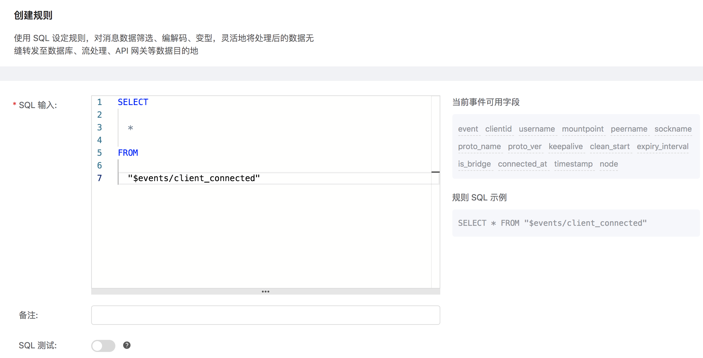

关联动作:

在 “响应动作” 界面选择 “添加动作”，然后在 “动作” 下拉框里选择 “从 Redis 中获取订阅关系”。


填写动作参数:

“从 Redis 中获取订阅列表”动作需要一个参数：

1). 关联资源。现在资源下拉框为空，可以点击右上角的 “新建资源” 来创建一个 Redis 资源:

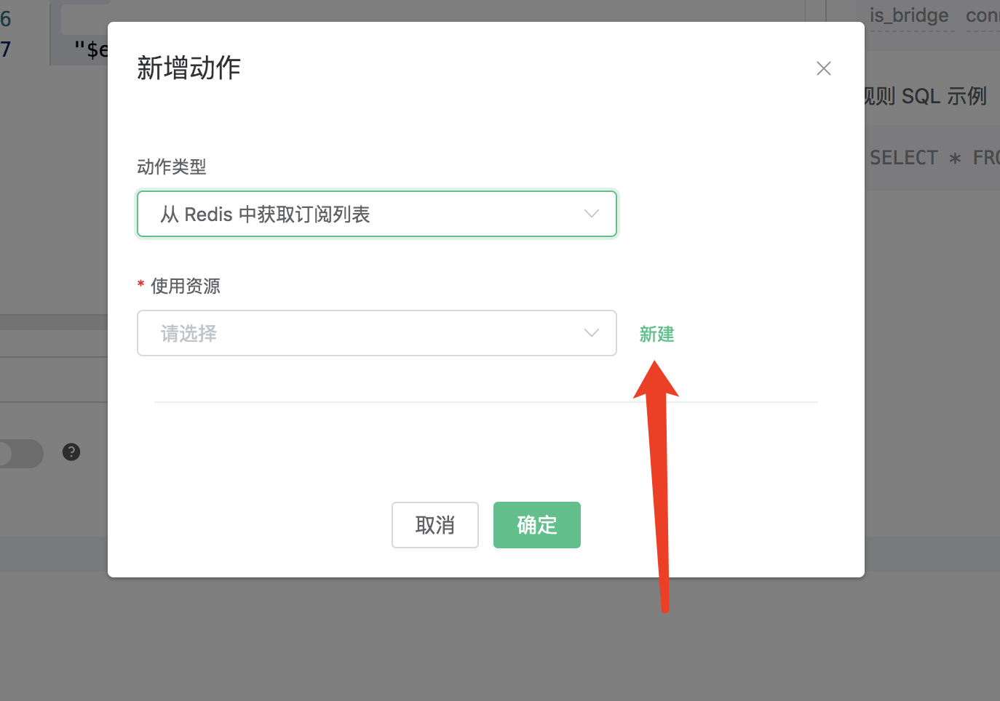

选择 Redis 单节点模式资源”。

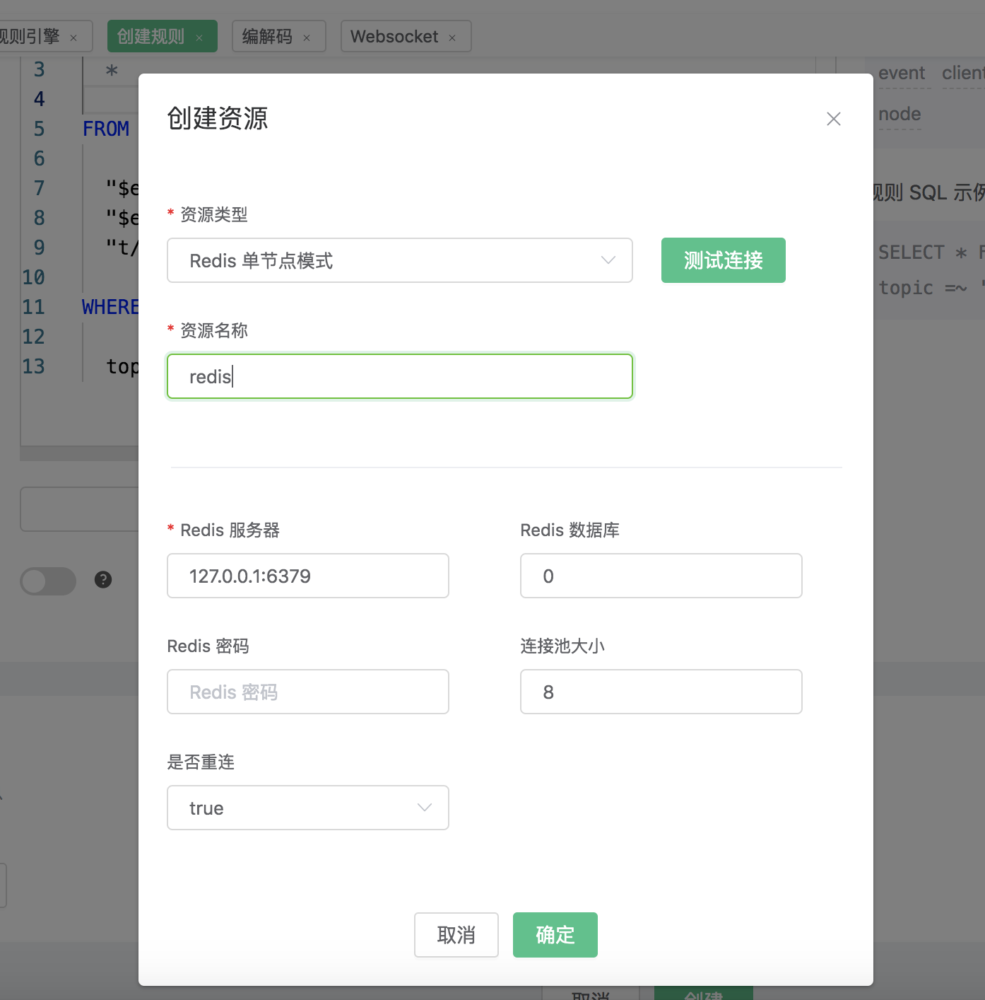

填写资源配置:

   填写真实的 Redis 服务器地址，其他配置保持默认值，然后点击 “测试连接” 按钮，确保连接测试成功。

最后点击 “新建” 按钮。

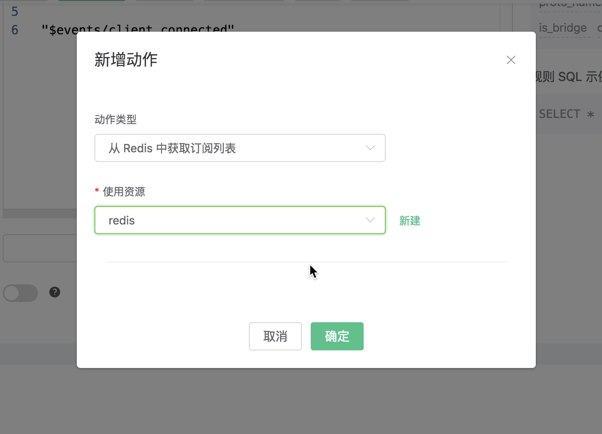

返回响应动作界面，点击 “确认”。

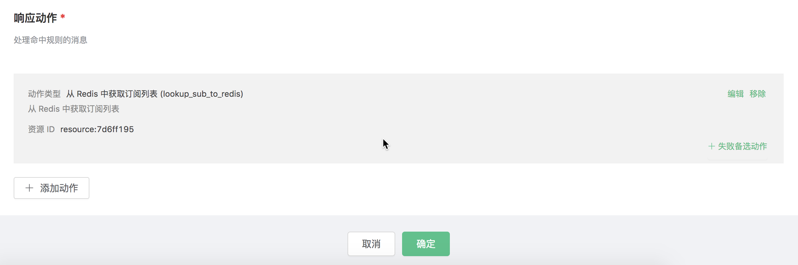

返回规则创建界面，点击 “新建”。


规则已经创建完成，通过 Redis CLI 往Redis插入一条订阅关系:

```bash
HSET mqtt:sub:test t1 1
```

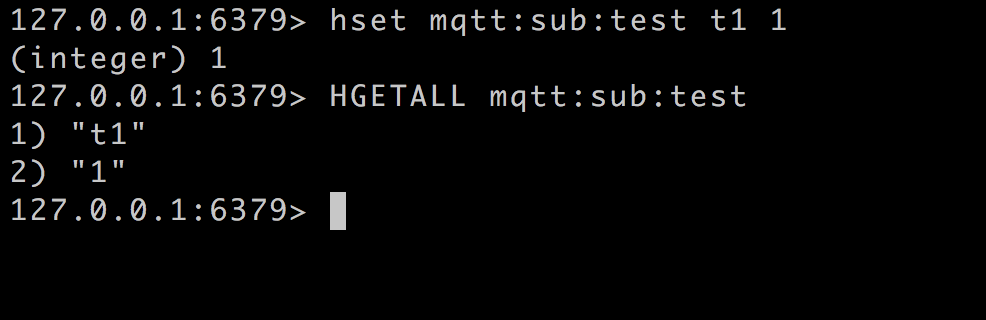

通过 Dashboard  登录 clientid 为 test 的设备:


查看订阅列表，可以看到 **test** 设备已经订阅了 **t1** 主题:


## 从 MySQL 中获取订阅关系

搭建 MySQL 数据库，并设置用户名密码为 root/public，以 MacOS X 为例:
```bash
$ brew install mysql

$ brew services start mysql

$ mysql -u root -h localhost -p

ALTER USER 'root'@'localhost' IDENTIFIED BY 'public';
```

初始化 MySQL 数据库:
```bash
$ mysql -u root -h localhost -ppublic

create database mqtt;
```

创建 mqtt_sub 表:
```sql
DROP TABLE IF EXISTS `mqtt_sub`;

CREATE TABLE `mqtt_sub` (
  `id` int(11) unsigned NOT NULL AUTO_INCREMENT,
  `clientid` varchar(64) DEFAULT NULL,
  `topic` varchar(180) DEFAULT NULL,
  `qos` tinyint(1) DEFAULT NULL,
  PRIMARY KEY (`id`),
  KEY `mqtt_sub_idx` (`clientid`,`topic`,`qos`),
  UNIQUE KEY `mqtt_sub_key` (`clientid`,`topic`),
  INDEX topic_index(`id`, `topic`)
) ENGINE=InnoDB DEFAULT CHARSET=utf8MB4;
```



订阅关系表结构不能修改，请使用上面SQL语句创建



创建规则:

打开 [EMQ X Dashboard](http://127.0.0.1:18083/#/rules)，选择左侧的“规则”选项卡。

然后填写规则 SQL:

```bash
SELECT * FROM "$events/client_connected"
```


关联动作:

在“响应动作”界面选择“添加动作”，然后在“新增动作”下拉框里选择“从MySQL中获取订阅列表”

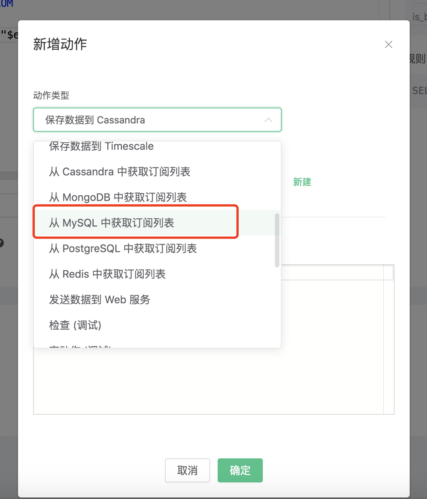

填写动作参数:

“从 MySQL 中获取订阅列表”动作需要一个参数：

1). 关联资源。现在资源下拉框为空，可以点击右上角的 “新建” 来创建一个 MySQL 资源：

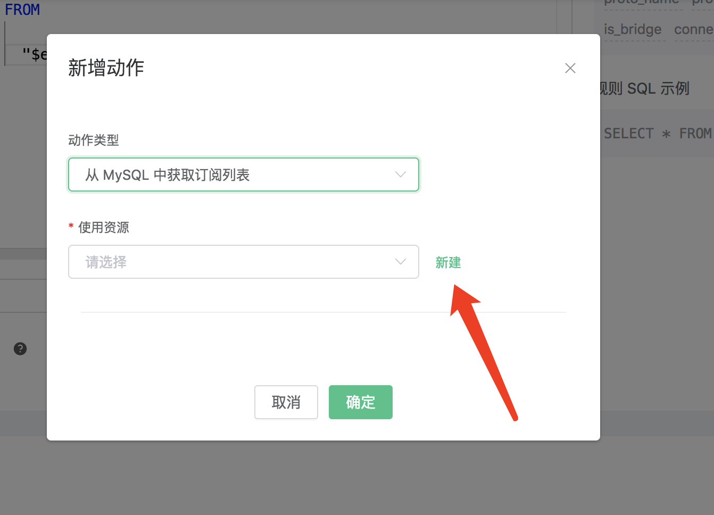

弹出“创建资源”对话框


填写资源配置:

   填写真实的 MySQL 服务器地址，其他配置相应的值，然后点击 “测试连接” 按钮，确保连接测试成功。

最后点击 “确定” 按钮。

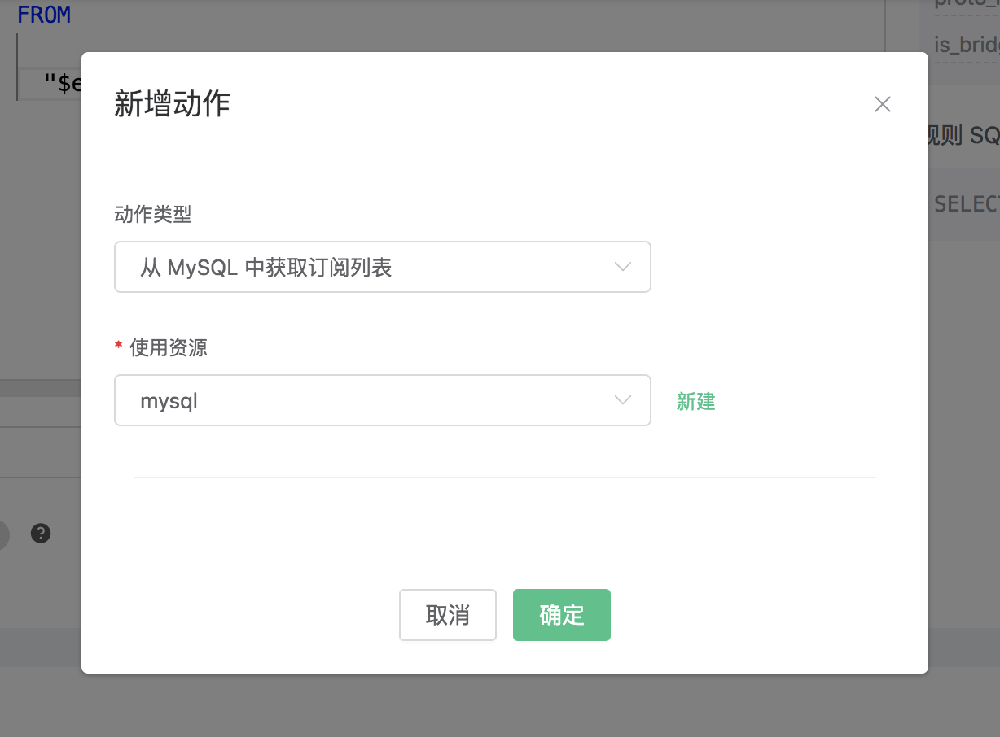

返回响应动作界面，点击 “确认”。


返回规则创建界面，点击 “创建”。


规则已经创建完成，通过 “mysql” 往MySQL插入一条订阅关系:

```
insert into mqtt_sub(clientid, topic, qos) values("test", "t1", 1);
```


通过 Dashboard 登录 clientid 为 test 的设备:


查看“订阅”列表，可以看到 Broker 从 MySQL 里面获取到订阅关系，并代理设备订阅:


## 从 PostgreSQL 中获取订阅关系

搭建 PostgreSQL 数据库，以 MacOS X 为例:
```bash
$ brew install postgresql
$ brew services start postgresql
```

创建 mqtt 数据库:

```
# 使用用户名 postgres 创建名为 'mqtt' 的数据库
$ createdb -U postgres mqtt

$ psql -U postgres mqtt

mqtt=> \dn;
List of schemas
Name  | Owner
--------+-------
public | postgres
(1 row)
```

创建 mqtt_sub 表:

```sql
$ psql -U postgres mqtt
CREATE TABLE mqtt_sub(
  id SERIAL8 primary key,
  clientid character varying(64),
  topic character varying(255),
  qos integer,
  UNIQUE (clientid, topic)
);
```



订阅关系表结构不能修改，请使用上面SQL语句创建



创建规则:

打开 [EMQ X Dashboard](http://127.0.0.1:18083/#/rules)，选择左侧的“规则”选项卡。

然后填写规则 SQL:

```bash
SELECT * FROM "$events/client_connected"
```


关联动作:

在“响应动作”界面选择“添加动作”，然后在“新增动作”下拉框里选择“从PostgreSQL中获取订阅列表”

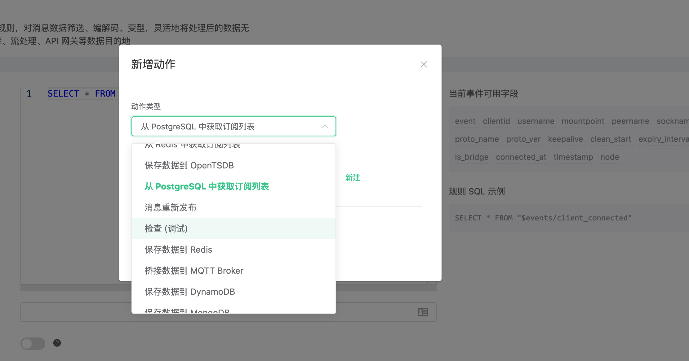

填写动作参数:

“从PostgreSQL中获取订阅列表“ 动作需要一个参数：

1). 关联资源。现在资源下拉框为空，可以点击右上角的 “新建” 来创建一个 PostgreSQL 资源：

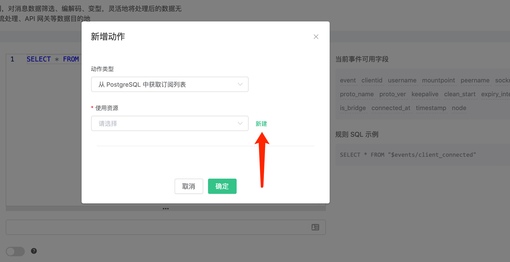

弹出“创建资源”对话框


填写资源配置:

   填写真实的 PostgreSQL 服务器地址，其他配置相应的值，然后点击 “测试连接” 按钮，确保连接测试成功。

最后点击 “确定” 按钮。


返回响应动作界面，点击 “确认”。

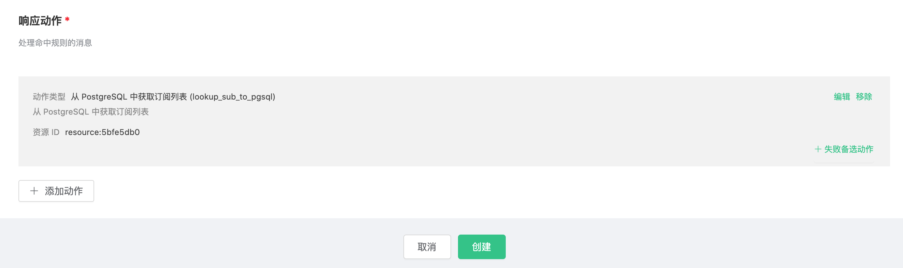

返回规则创建界面，点击 “创建”。


规则已经创建完成，通过 “psql” 往PostgreSQL插入一条订阅关系

```
insert into mqtt_sub(clientid, topic, qos) values('test', 't1', 1)'
```

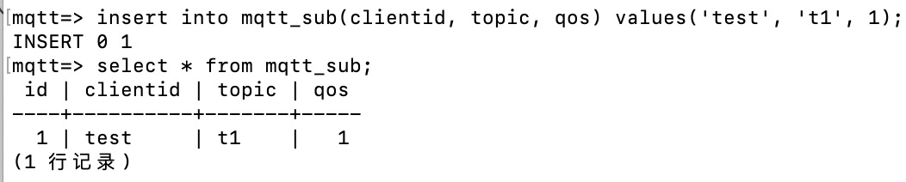

通过 Dashboard 登录 clientid 为 test 的设备:


查看“订阅”列表，可以看到 Broker 从 PostgreSQL 里面获取到订阅关系，并代理设备订阅:

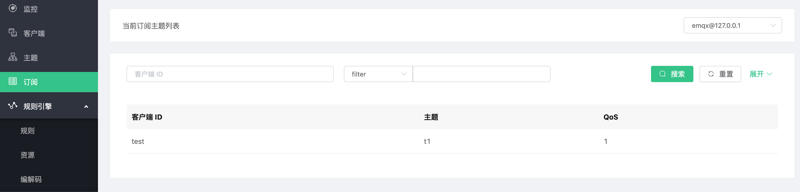

## 从 Cassandra 中获取订阅关系

搭建 Cassandra 数据库，并设置用户名密码为 root/public，以 MacOS X 为例:
```bash
$ brew install cassandra
## 修改配置，关闭匿名认证
$  vim /usr/local/etc/cassandra/cassandra.yaml

    authenticator: PasswordAuthenticator
    authorizer: CassandraAuthorizer

$ brew services start cassandra

## 创建 root 用户
$ cqlsh -ucassandra -pcassandra

create user root with password 'public' superuser;
```

创建 "mqtt" 表空间:
```bash
$ cqlsh -uroot -ppublic

CREATE KEYSPACE mqtt WITH replication = {'class': 'SimpleStrategy', 'replication_factor': '1'}  AND durable_writes = true;
```

创建 mqtt_sub 表:

```sql

CREATE TABLE mqtt_sub (
    clientid text,
    topic text,
    qos int,
    PRIMARY KEY (clientid, topic)
) WITH CLUSTERING ORDER BY (topic ASC)
    AND bloom_filter_fp_chance = 0.01
    AND caching = {'keys': 'ALL', 'rows_per_partition': 'NONE'}
    AND comment = ''
    AND compaction = {'class': 'org.apache.cassandra.db.compaction.SizeTieredCompactionStrategy', 'max_threshold': '32', 'min_threshold': '4'}
    AND compression = {'chunk_length_in_kb': '64', 'class': 'org.apache.cassandra.io.compress.LZ4Compressor'}
    AND crc_check_chance = 1.0
    AND dclocal_read_repair_chance = 0.1
    AND default_time_to_live = 0
    AND gc_grace_seconds = 864000
    AND max_index_interval = 2048
    AND memtable_flush_period_in_ms = 0
    AND min_index_interval = 128
    AND read_repair_chance = 0.0
    AND speculative_retry = '99PERCENTILE';

```



订阅关系表结构不能修改，请使用上面SQL语句创建



创建规则:

打开 [EMQ X Dashboard](http://127.0.0.1:18083/#/rules)，选择左侧的“规则”选项卡。

然后填写规则 SQL:

```bash
SELECT * FROM "$events/client_connected"
```


关联动作:

在“响应动作”界面选择“添加动作”，然后在“新增动作”下拉框里选择“从 Cassandra 中获取订阅列表”

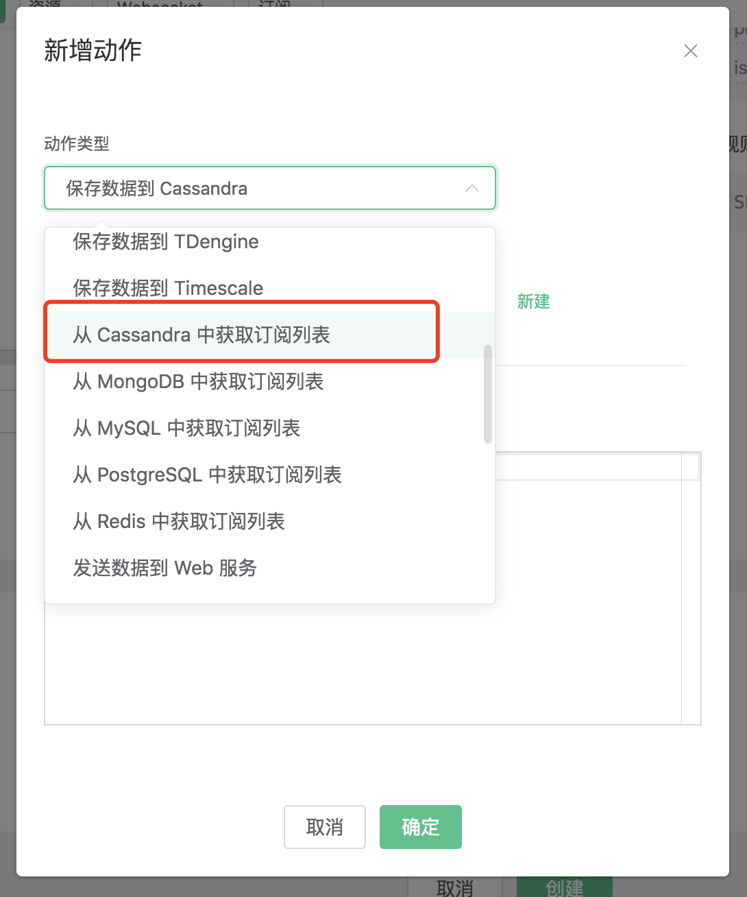

填写动作参数:

“从 Cassandra 中获取订阅列表”动作需要一个参数：

1). 关联资源。现在资源下拉框为空，可以点击右上角的 “新建” 来创建一个 Cassandra 资源：


弹出“创建资源”对话框


填写资源配置:

   填写真实的 Cassandra 服务器地址，其他配置相应的值，然后点击 “测试连接” 按钮，确保连接测试成功。

最后点击 “确定” 按钮。


返回响应动作界面，点击 “确认”。


返回规则创建界面，点击 “创建”。

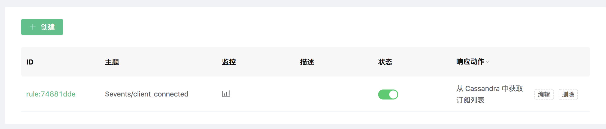

规则已经创建完成，通过 “cqlsh” 往 Cassandra 插入一条订阅关系:

```
insert into mqtt_sub(clientid, topic, qos) values('test', 't1', 1);
```


通过 Dashboard 登录 clientid 为 test 的设备:

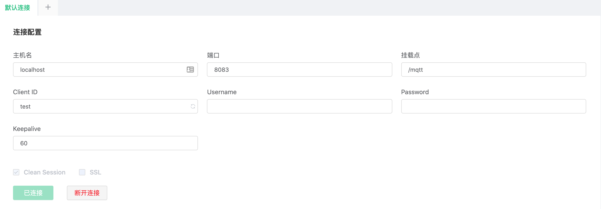

查看“订阅”列表，可以看到 Broker 从 Cassandra 里面获取到订阅关系，并代理设备订阅:


## 从 MongoDB 中获取订阅关系

搭建 MongoDB 数据库，并设置用户名密码为 root/public，以 MacOS X 为例:
```bash
$ brew install mongodb
$ brew services start mongodb

## 新增 root/public 用户
$ use mqtt;
$ db.createUser({user: "root", pwd: "public", roles: [{role: "readWrite", db: "mqtt"}]});

## 修改配置，关闭匿名认证
$ vi /usr/local/etc/mongod.conf

    security:
    authorization: enabled

$ brew services restart mongodb
```

创建 mqtt_sub 表:
```sql
$ mongo 127.0.0.1/mqtt -uroot -ppublic
db.createCollection("mqtt_sub");
```

创建规则:

打开 [EMQ X Dashboard](http://127.0.0.1:18083/#/rules)，选择左侧的“规则”选项卡。

然后填写规则 SQL:

```bash
SELECT * FROM "$events/client_connected"
```


关联动作:

在“响应动作”界面选择“添加动作”，然后在“新增动作”下拉框里选择“从MongoDB中获取订阅列表”

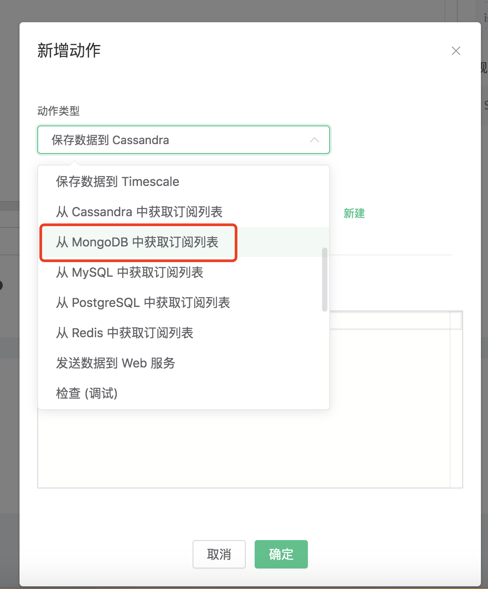

填写动作参数:

“从 MongoDB 中获取订阅列表”动作需要一个参数：

1). 关联资源。现在资源下拉框为空，可以点击右上角的 “新建” 来创建一个 MongoDB 资源：


弹出“创建资源”对话框

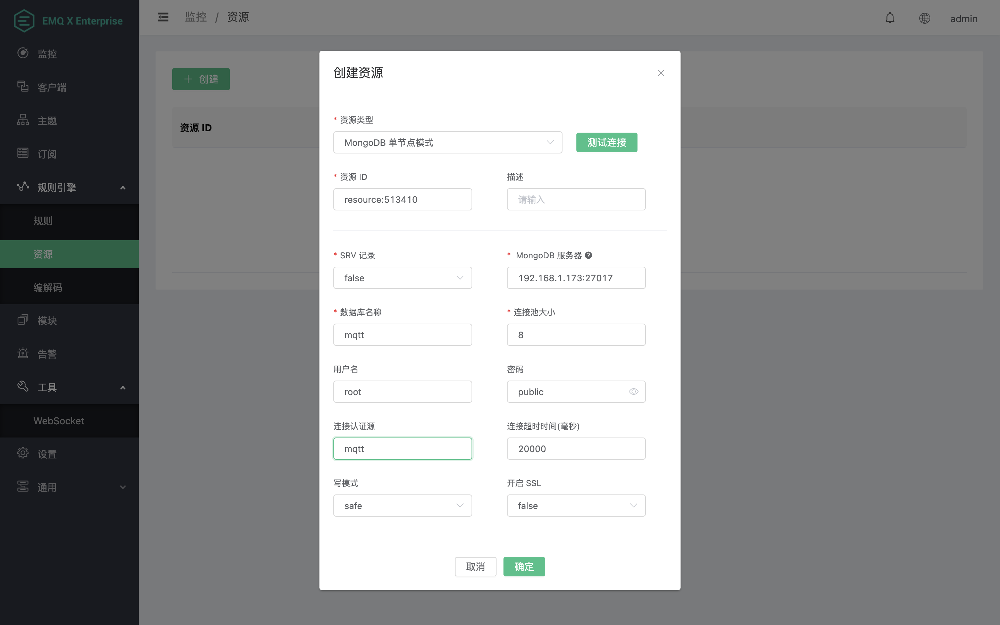

填写资源配置:

   填写真实的 MongoDB 服务器地址，其他配置相应的值，然后点击 “测试连接” 按钮，确保连接测试成功。

最后点击 “确定” 按钮。


返回响应动作界面，点击 “确认”。

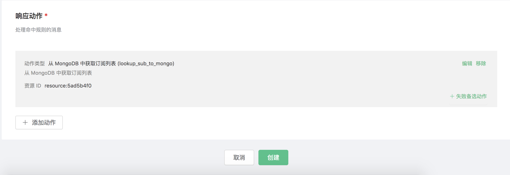

返回规则创建界面，点击 “创建”。


规则已经创建完成，通过 “mongo” 往MongoDB插入一条订阅关系

```
db.mqtt_sub.insert({clientid: "test", topic: "t1", qos: 1})
```


通过 Dashboard 登录 clientid 为 test 的设备:


查看“订阅”列表，可以看到 Broker 从 MongoDB 里面获取到订阅关系，并代理设备订阅:

